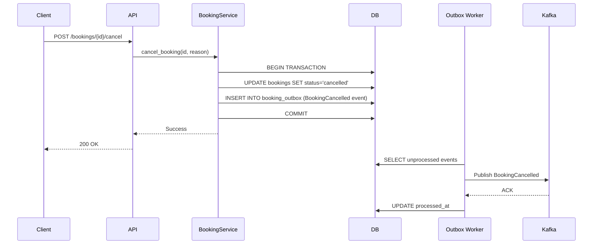
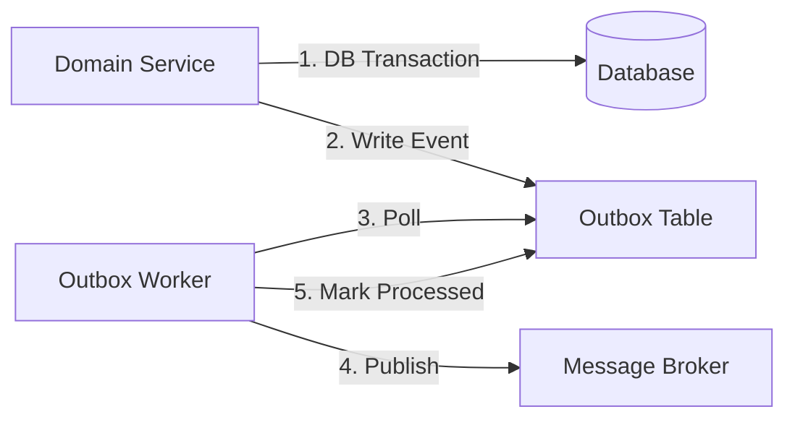
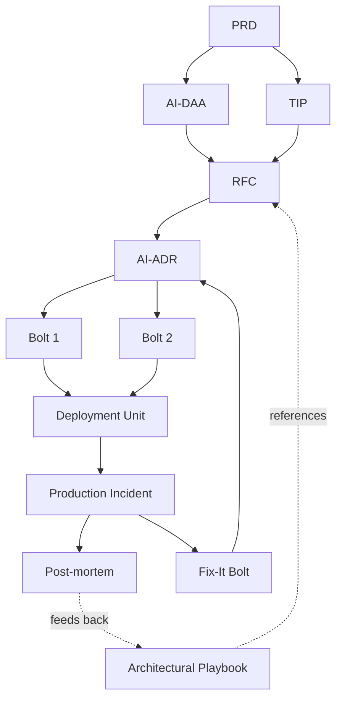

# AirSDLC Artifacts

## Overview

Artifacts are the structured data objects that flow through the AirSDLC lifecycle. Each artifact has a specific purpose, defined structure, and clear ownership model. This document provides detailed specifications for each core artifact type.

## Artifact Classification

Artifacts can be classified along two dimensions:

### By Lifecycle Phase
| Phase | Artifacts |
|-------|-----------|
| **Inception** | PRD, AI-DAA, TIP |
| **Design** | RFC, AI-ADR, Architectural Playbook |
| **Construction** | Bolt, Deployment Unit |
| **Operations** | Post-mortem, Fix-It Bolt |

### By Technology Specificity
| Classification | Artifacts |
|----------------|-----------|
| **Technology-Agnostic** | PRD, AI-DAA |
| **Technology-Specific** | TIP, RFC, AI-ADR, Bolt |

---

## Phase 1 Artifacts: Inception

### 1. PRD (Product Requirements Document)

**Purpose**: Define the business requirements and success criteria for a feature.

**Generator**: Product Manager (with optional AI assistance)

**Consumers**: Engineering team, AI (for DAA generation)

**Key Characteristics**:
- Business-focused (minimal technical details)
- Structured and parseable by AI
- Contains clear success metrics

**Mandatory Sections**:

#### 1. Feature Overview
- **Title**: Descriptive name
- **Objective**: One-paragraph summary of the business goal
- **Target Users**: Who will use this feature?

#### 2. User Stories
Format: "As a [role], I want [capability] so that [benefit]"

Each story must include:
- **Acceptance Criteria**: Testable conditions for "done"
- **Priority**: Must-have, should-have, nice-to-have

#### 3. Non-Functional Requirements (NFRs)
- **Performance**: Response times, throughput requirements
- **Availability**: Uptime requirements (e.g., 99.9%)
- **Scalability**: Expected load (users, transactions, data volume)
- **Security**: Authentication, authorization, data protection
- **Compliance**: Regulatory requirements (GDPR, PCI-DSS, etc.)

#### 4. Risk Assessment
- **Identified Risks**: What could go wrong?
- **Mitigation Strategies**: How to reduce risk
- **Assumptions**: What we're assuming to be true

#### 5. Success Metrics
- **Primary KPI**: The main measure of success
- **Secondary Metrics**: Supporting indicators
- **Measurement Method**: How these will be tracked

#### 6. Constraints
- **Timeline**: Deadlines, milestones
- **Budget**: Resource limitations
- **Technical Constraints**: Must use specific technologies, integrate with existing systems
- **Team Constraints**: Available skills, team size

**Example Structure**:
```markdown
# PRD: Booking Notes Feature

## 1. Feature Overview
- **Title**: Booking Notes
- **Objective**: Allow users to add custom notes to their bookings
- **Target Users**: All users with reservations

## 2. User Stories
### Story 1: Add Notes
As a user, I want to add notes to my booking so that I can easily remember important details.

**Acceptance Criteria**:
- User can set notes via mobile app
- Notes are 1-200 characters
- Notes are displayed in booking details
- User can change notes anytime

**Priority**: Must-have

## 3. Non-Functional Requirements
- **Performance**: Notes save < 500ms
- **Availability**: 99.9% uptime
- **Security**: Notes are user-specific (no cross-user access)

## 4. Risks
- **Risk**: Inappropriate content in notes
- **Mitigation**: Implement content moderation filter

## 5. Success Metrics
- **Primary KPI**: 40% of users add notes within 30 days
- **Secondary**: < 1% support tickets related to notes feature

## 6. Constraints
- **Timeline**: Must launch in 2 weeks
- **Technical**: Must integrate with existing booking service API
```

---

### 2. AI-DAA (Domain Architecture Analysis)

**Purpose**: Provide a pure, technology-agnostic model of the business domain using Domain-Driven Design patterns.

**Generator**: AI (from PRD input)

**Validators**: Domain experts, architects, senior engineers

**Consumers**: Engineers (for design), AI (for ADR generation)

**Key Characteristics**:
- 100% technology-neutral (no databases, languages, frameworks)
- Uses DDD patterns consistently
- Written in clear pseudocode
- Every business invariant is explicit

**Mandatory Sections**:

#### 1. Strategic Design

**1.1 Bounded Contexts**
Define logical boundaries for different parts of the domain.

```
BOUNDED_CONTEXT: Booking Management
  RESPONSIBILITY: 
    - Booking lifecycle management
    - Booking state transitions
    - Booking-level business rules
  
  UBIQUITOUS_LANGUAGE:
    - Booking: A reservation for a room or resource
    - BookingStatus: confirmed | cancelled | completed
    - Cancel: Termination of a confirmed booking
```

**1.2 Context Map**
Define relationships between Bounded Contexts.

```
CONTEXT_MAP:
  [Booking Management] --publishes events--> [Notification Service]
  [Booking Management] --queries--> [User Service]
  [Booking Management] <--ACL-- [External Property Management System]
```

#### 2. Tactical Design

**2.1 Aggregates**
Define consistency boundaries with a root entity.

```pseudocode
AGGREGATE: Booking
  AGGREGATE_ROOT: Booking
    IDENTITY: booking_id (UUID)
    
    ATTRIBUTES:
      user_id: UserID (reference to User aggregate)
      status: BookingStatus (value object)
      confirmation_code: ConfirmationCode (value object)
      room_details: RoomDetails (value object)
      created_at: Timestamp
      updated_at: Timestamp
    
    INVARIANTS:
      - confirmation_code must be unique across all bookings
      - status transitions must follow state machine
      - only confirmed bookings can be cancelled
      - completed bookings are terminal (no further transitions)
    
    OPERATIONS:
      create(user_id, room_id, dates) → BookingConfirmed
        PRECONDITION: user exists and room is available
        POSTCONDITION: booking.status = confirmed
        DOMAIN_EVENT: BookingConfirmed
        
      cancel(reason) → BookingCancelled
        PRECONDITION: status = confirmed
        POSTCONDITION: status = cancelled
        DOMAIN_EVENT: BookingCancelled
        
      complete() → BookingCompleted
        PRECONDITION: status = confirmed AND check-out date passed
        POSTCONDITION: status = completed
        DOMAIN_EVENT: BookingCompleted
        
      modify(new_dates) → BookingModified
        PRECONDITION: status = confirmed
        POSTCONDITION: dates updated, status remains confirmed
        DOMAIN_EVENT: BookingModified
```

**2.2 Value Objects**
Immutable objects defined by their attributes.

```pseudocode
VALUE_OBJECT: BookingStatus
  ALLOWED_VALUES: [confirmed, cancelled, completed]
  
  OPERATIONS:
    can_transition_to(new_status) → Boolean
      RULES:
        confirmed → cancelled: YES
        confirmed → completed: YES
        cancelled → *: NO
        completed → *: NO
```

**2.3 Domain Events**
Significant occurrences in the domain.

```pseudocode
DOMAIN_EVENT: BookingCancelled
  ATTRIBUTES:
    booking_id: UUID
    reason: String
    cancelled_at: Timestamp
    cancelled_by: UserID
  
  CONSUMERS:
    - Notification Service (send alert to user)
    - Analytics Service (track cancellation reasons)
    - Audit Log (compliance)
```

**2.4 Domain Services**
Operations that don't naturally belong to a single Aggregate.

```pseudocode
DOMAIN_SERVICE: BookingReservationService
  OPERATION: create_booking(user_id, room_id, dates) → Result<Booking, ReservationError>
    STEPS:
      1. Verify user exists and is eligible
      2. Check room availability for dates
      3. Generate unique confirmation_code
      4. Create Booking aggregate
      5. Publish BookingConfirmed event
      6. Return Booking or ReservationError
```

**Validation Checklist for AI-DAA**:
- [ ] Every user story from PRD maps to at least one operation
- [ ] All business invariants are explicitly stated
- [ ] No technology-specific terms (databases, APIs, frameworks)
- [ ] Aggregates have clear boundaries (no god objects)
- [ ] Domain events are named in past tense
- [ ] Value objects are immutable
- [ ] State machines are fully specified

---

### 3. TIP (Technical Implementation Proposal)

**Purpose**: Engineer's initial technical proposal for simple, well-understood features (Lightweight Workflow alternative to AI-DAA).

**Generator**: Engineer

**Validators**: Peer engineers, architect (in design review)

**Consumers**: Design team (for RFC creation)

**Key Characteristics**:
- Technology-specific (mentions actual databases, APIs, frameworks)
- More concrete and direct than DAA
- Suitable for simple features where domain modeling is overkill

**Suggested Sections**:

#### 1. Context
- Link to PRD
- Brief summary of the feature

#### 2. Proposed Implementation

**2.1 Database Changes**
```sql
-- Example: Add notes column
ALTER TABLE bookings ADD COLUMN notes VARCHAR(200);
CREATE INDEX idx_bookings_user_id ON bookings(user_id);
```

**2.2 API Changes**
```
PUT /v1/bookings/{booking_id}/notes
Request:
  {
    "notes": "Ground floor room preferred"
  }
Response:
  200 OK
  {
    "booking_id": "123",
    "notes": "Ground floor room preferred"
  }
```

**2.3 Service Logic**
- Update `BookingService.setNotes()` method
- Add validation: 1-200 characters, no special characters
- Audit log notes changes

**2.4 Testing**
- Unit tests for validation logic
- Integration test for full API flow
- Edge case: Set notes to existing value (idempotent)

#### 3. Open Questions
- Do we need to audit-log notes changes for compliance?
- Should notes be searchable?

#### 4. Effort Estimate
- Implementation: 4 hours
- Testing: 2 hours
- Code review: 1 hour

**When to Use TIP vs. AI-DAA**:

| Use TIP When | Use AI-DAA When |
|--------------|-----------------|
| Feature is simple CRUD | Feature has complex business rules |
| Domain is well-understood | Domain is unfamiliar |
| Implementation is obvious | Multiple approaches possible |
| Timeline is tight | High-risk or critical feature |
| Feature touches 1-2 services | Feature spans multiple bounded contexts |

---

## Phase 2 Artifacts: Design

### 4. RFC (Request for Comments)

**Purpose**: Formalize a design proposal and facilitate collaborative review.

**Generator**: Engineer (assembles from DAA/TIP + own thoughts)

**Validators**: Team (architects, senior engineers, domain experts)

**Consumers**: Design reviewers, AI (for generating ADR)

**Key Characteristics**:
- Forum for discussion (not finalized)
- Contains both domain understanding (DAA/TIP) and proposed technical approach
- Explicitly lists open questions and constraints

**Mandatory Sections**:

#### 1. Metadata
- **RFC Number**: Sequential (e.g., RFC-042)
- **Title**: Descriptive name
- **Author**: Who wrote this
- **Status**: Draft | Under Review | Approved | Rejected | Superseded
- **Created**: Date
- **Last Updated**: Date

#### 2. Context & Problem Statement
- **Link to PRD**: Traceability to business requirements
- **Problem Summary**: What we're trying to solve
- **Domain Model** (if Full Workflow): Link to or embed AI-DAA
- **Technical Context**: Existing system, constraints

#### 3. Proposed Solution
- **High-Level Approach**: Overall strategy
- **Component Design**: Services, APIs, data models
- **Technology Choices**: Databases, frameworks, third-party services
- **Integration Points**: How this fits with existing systems
- **Diagrams**: Architecture diagrams, sequence diagrams (use diagrams-as-code)

#### 4. Alternatives Considered
- **Alternative 1**: Approach 2, why rejected
- **Alternative 2**: Approach 3, why rejected

#### 5. Trade-offs & Risks
- **Pro**: Benefits of this approach
- **Con**: Drawbacks or limitations
- **Risks**: What could go wrong
- **Mitigations**: How to reduce risks

#### 6. Open Questions
- What decisions need input from others?
- What unknowns need investigation?

#### 7. Edge Cases & Non-Functional Considerations
- **Performance**: How will this scale?
- **Security**: What are the security implications?
- **Failure Modes**: What happens when things go wrong?
- **Monitoring**: How will we observe this in production?

**RFC Evolution**:
1. **Draft**: Initial proposal
2. **Under Review**: Team is discussing
3. **Approved**: Design is finalized → Generate AI-ADR
4. **Rejected**: Not moving forward
5. **Superseded**: Replaced by newer RFC

---

### 5. AI-ADR (Architectural Decision Record)

**Purpose**: Immutable record of a finalized architectural decision. This is the executable specification for implementation.

**Generator**: AI (after Collaborative Design session)

**Validators**: Architect, senior engineer

**Consumers**: Engineers (for implementation), AI (for code generation), Operations (for context)

**Key Characteristics**:
- Final and immutable (amendments create new ADRs)
- Links back to DAA to show domain alignment
- Contains enough detail to guide implementation
- Explicitly documents trade-offs

**Mandatory Sections**:

#### 1. Metadata
- **ADR Number**: Sequential (e.g., ADR-023)
- **Title**: Short, descriptive
- **Status**: Proposed | Accepted | Deprecated | Superseded
- **Date**: When finalized
- **Context Links**:
  - PRD: [link]
  - DAA: [link] (if applicable)
  - RFC: [link]

#### 2. Context
What is the problem or feature we're designing?

**Example**:
> We are implementing the Booking Cancellation feature as defined in PRD-015. The AI-DAA identified the `Booking.cancel()` operation as a state transition that must preserve domain invariants (only confirmed bookings can be cancelled). We need to decide how to implement this in a way that guarantees consistency and reliable event delivery.

#### 3. Decision
A clear, concise statement of the chosen approach.

**Example**:
> We will implement the Booking Cancellation feature as follows:
> 1. Use a synchronous database transaction to update booking status
> 2. Employ the Transactional Outbox Pattern to publish `BookingCancelled` events
> 3. A separate worker will relay events from the outbox to Kafka
> 4. The Notification Service will consume events asynchronously

#### 4. Rationale
Why was this decision made? What were the constraints?

**Example**:
> - The DAA specifies that only confirmed bookings can be cancelled (invariant)
> - We need guaranteed event delivery for compliance (NFR from PRD)
> - Synchronous external calls were rejected due to failure coupling risk
> - The Transactional Outbox Pattern (from Playbook entry "OUTBOX-001") provides atomicity between database write and event publish
> - Trade-off: Slight latency in event delivery is acceptable per PRD requirements

#### 5. Implementation Details

**5.1 Technology Choices**
- Language: Go 1.21
- Database: PostgreSQL 15
- Message Broker: Kafka 3.5
- Framework: Standard library + custom DDD patterns

**5.2 Database Schema**
```sql
CREATE TABLE bookings (
  booking_id UUID PRIMARY KEY,
  user_id UUID NOT NULL,
  status VARCHAR(20) NOT NULL CHECK (status IN ('confirmed', 'cancelled', 'completed')),
  created_at TIMESTAMP NOT NULL,
  updated_at TIMESTAMP NOT NULL
);

CREATE TABLE booking_outbox (
  id BIGSERIAL PRIMARY KEY,
  aggregate_id UUID NOT NULL,
  event_type VARCHAR(100) NOT NULL,
  event_payload JSONB NOT NULL,
  created_at TIMESTAMP NOT NULL DEFAULT NOW(),
  processed_at TIMESTAMP
);
```

**5.3 API Contract**
```
POST /v1/bookings/{booking_id}/cancel
Authorization: Bearer <token>

Request:
{
  "reason": "Plans changed"
}

Response:
200 OK
{
  "booking_id": "a1b2c3d4",
  "status": "cancelled",
  "cancelled_at": "2024-01-15T10:30:00Z"
}

Errors:
400 Bad Request - Invalid booking state
404 Not Found - Booking does not exist
403 Forbidden - User does not own booking
```

**5.4 Sequence Diagram**


#### 6. Edge Cases & Failure Handling
- **Idempotency**: Cancelling an already-cancelled booking returns success (idempotent)
- **Concurrent Cancellations**: Database-level status check prevents race conditions
- **Outbox Relay Failure**: Worker retries up to 3 times, then moves to dead-letter queue
- **Kafka Unavailable**: Events accumulate in outbox, processed when Kafka recovers

#### 7. Monitoring & Observability
- **Metrics**:
  - `booking_cancellation_requests_total` (counter)
  - `booking_cancellation_duration_seconds` (histogram)
  - `outbox_pending_events` (gauge)
- **Alerts**:
  - Outbox size > 10,000 events (indicates relay failure)
  - Cancellation API error rate > 1%

#### 8. Rejected Alternatives

**Alternative 1: Synchronous HTTP call to Notification Service**
- **Rejected because**: Creates tight coupling; booking cancellation fails if notification service is down
- **Trade-off**: Synchronous call would be simpler but violates availability NFR

**Alternative 2: Direct Kafka publish (without outbox)**
- **Rejected because**: No atomicity guarantee between DB write and event publish
- **Trade-off**: Slightly less complex, but risk of data inconsistency

#### 9. References
- Playbook Entry: OUTBOX-001 (Transactional Outbox Pattern)
- PRD: PRD-015 (Booking Management Features)
- DAA: Section 3.2 (Booking Aggregate)

**ADR Lifecycle**:
- **Proposed**: Draft awaiting approval
- **Accepted**: Approved, ready for implementation
- **Deprecated**: No longer used but kept for historical record
- **Superseded**: Replaced by a newer ADR (link to replacement)

---

### 6. Architectural Playbook

**Purpose**: A living library of approved architectural patterns and solutions to common cross-cutting concerns.

**Generator**: Architects, senior engineers (collaboratively)

**Validators**: Architecture review board

**Consumers**: Engineers (during design), AI (as knowledge base for sparring)

**Key Characteristics**:
- Curated, vetted patterns only
- Self-contained entries
- Explicitly documents trade-offs

**Structure of a Playbook Entry**:

#### Entry Metadata
- **Pattern ID**: OUTBOX-001
- **Name**: Transactional Outbox Pattern
- **Category**: Event-Driven Architecture
- **Status**: Active | Deprecated

#### 1. Problem
What recurring problem does this solve?

**Example**:
> How do we guarantee atomicity between a database write and publishing an asynchronous message? Direct Kafka publishing from application code risks data inconsistency if the publish fails after the DB commit.

#### 2. Context
When should this pattern be used? When should it NOT be used?

**Example**:
> **Use when**:
> - You need guaranteed at-least-once event delivery
> - You're using a relational database
> - Event order matters
>
> **Do NOT use when**:
> - You can tolerate event loss
> - You need real-time streaming (< 100ms latency)
> - You don't have transactional database support

#### 3. Solution
Detailed implementation guide.

**Example**:
> 1. Within the same database transaction that modifies domain data, insert an event record into an "outbox" table
> 2. A separate worker process polls the outbox table for unprocessed events
> 3. Worker publishes events to message broker (Kafka, RabbitMQ)
> 4. Upon successful publish, worker marks the event as processed

**Reference Architecture**:


#### 4. Implementation Checklist
Critical details to address:

- [ ] Outbox table has index on `created_at` and `processed_at`
- [ ] Worker implements retry logic (3 attempts with exponential backoff)
- [ ] Dead-letter queue configured for poison pills
- [ ] Monitoring for outbox table size (alert if > 10k events)
- [ ] Event ordering guaranteed within same aggregate_id
- [ ] Worker implements graceful shutdown (no partial processing)

#### 5. Trade-offs

**Pros**:
- ✅ Guarantees at-least-once delivery
- ✅ Atomic consistency (event + data change)
- ✅ Decouples services

**Cons**:
- ❌ Adds implementation complexity
- ❌ Introduces potential message latency (seconds)
- ❌ Requires outbox table maintenance
- ❌ Consumers must handle duplicate events (at-least-once semantics)

#### 6. Examples
Link to real ADRs or code that use this pattern.

**Example**:
- ADR-023: Booking Cancellation Event Publishing
- ADR-031: User Profile Update Events
- Reference Implementation: [github.com/example/outbox-pattern-go]

#### 7. Related Patterns
- **Saga Pattern**: For distributed transactions
- **Event Sourcing**: For complete audit trail
- **CQRS**: For read-optimized views

---

## Phase 3 Artifacts: Construction & Operations

### 7. Bolt

**Purpose**: A discrete, focused implementation unit with a single goal.

**Generator**: Engineer (breaks down ADR into Bolts)

**Validators**: Code reviewer

**Consumers**: Team (for tracking progress)

**Key Characteristics**:
- Completable in hours or days (not weeks)
- Single, clear goal
- Produces testable artifact
- Maps directly to part of an ADR

**Structure**:

#### Bolt Metadata
- **Bolt ID**: BOLT-042
- **ADR**: ADR-023 (Booking Cancellation Implementation)
- **Goal**: Implement POST /bookings/{id}/cancel API endpoint
- **Assignee**: Engineer name
- **Status**: TODO | In Progress | In Review | Done
- **Estimated Effort**: 6 hours
- **Actual Effort**: (filled after completion)

#### Acceptance Criteria
From the ADR:
- [ ] API endpoint returns 200 for valid requests
- [ ] Status is updated to 'cancelled' in database
- [ ] Event is written to outbox table
- [ ] Transaction is atomic (both or neither)
- [ ] Unit tests cover happy path and error cases
- [ ] Integration test validates full flow

#### Implementation Notes
- Started: 2024-01-15 10:00
- Completed: 2024-01-15 16:30
- PR: #123
- Challenges: Race condition in status check, fixed with SELECT FOR UPDATE

---

### 8. Deployment Unit

**Purpose**: The final, operations-ready package containing code, tests, and infrastructure configurations.

**Generator**: CI/CD pipeline (from completed Bolts)

**Validators**: CI/CD checks, smoke tests

**Consumers**: Operations team (for deployment)

**Contents**:
- **Application Code**: Compiled binaries or container images
- **Tests**: Unit, integration, end-to-end test suites
- **IaC**: Terraform, Kubernetes manifests, Helm charts
- **Configuration**: Environment-specific config files
- **Documentation**: Deployment guide, runbook
- **Rollback Plan**: How to safely revert

---

### 9. Post-mortem

**Purpose**: Document learnings from production incidents to feed back into the Knowledge Repository.

**Generator**: Incident commander (with team input)

**Validators**: Team, management

**Consumers**: Future designers (to avoid repeating mistakes), Knowledge Repository

**Structure**:

#### 1. Incident Summary
- **Incident ID**: INC-2024-001
- **Date**: 2024-01-15
- **Duration**: 2 hours 15 minutes
- **Severity**: SEV-2 (service degraded)
- **Impact**: 15% of booking cancellation requests failed

#### 2. Timeline
- 10:00 - Alert: Elevated error rate on booking cancellation API
- 10:05 - Incident declared, on-call engineer investigating
- 10:30 - Root cause identified: Outbox table deadlock
- 11:00 - Hotfix deployed: Added query timeout
- 12:15 - Incident resolved, monitoring normalized

#### 3. Root Cause Analysis
The outbox worker was holding long-running transactions, causing deadlocks when the API tried to insert new events.

**Contributing Factors**:
- Worker batch size was too large (1000 events)
- Database connection pool was under-sized
- ADR-023 did not specify transaction timeout requirements

#### 4. Resolution
- Reduced worker batch size to 100
- Increased database connection pool
- Added 5-second query timeout to all outbox operations

#### 5. Learnings & Action Items
- [ ] **ADR Amendment**: Update ADR-023 to include transaction timeout guidelines
- [ ] **Playbook Update**: Add "Outbox Performance Tuning" entry
- [ ] **Monitoring**: Add alert for database lock wait time
- [ ] **Documentation**: Update runbook with deadlock troubleshooting

#### 6. Traceability
- **ADR**: ADR-023 (Outbox Pattern Implementation)
- **Bolt**: BOLT-042 (Outbox Worker)
- **PRD**: PRD-015 (Booking Management)

---

### 10. Fix-It Bolt

**Purpose**: A micro-sized Bolt for rapid bug fixes during production incidents.

**Generator**: AI (proposes fix based on traceability chain)

**Validators**: On-call engineer

**Consumers**: CI/CD pipeline (for deployment)

**Structure**: Same as regular Bolt, but:
- **Scope**: Single bug fix only
- **Timeline**: Hours, not days
- **Process**: Expedited review (pair programming or immediate merge for hotfixes)

**Example**:
- **Fix-It Bolt ID**: FIX-001
- **Related Incident**: INC-2024-001
- **Root Cause**: Outbox worker deadlock
- **Fix**: Reduce batch size from 1000 to 100, add query timeout
- **Estimated Risk**: Low (reduces load, improves performance)
- **Rollback Plan**: Revert to previous worker configuration

---

## Artifact Relationships



---

## Validation Matrix

| Artifact | Validator | Validation Method | Acceptance Criteria |
|----------|-----------|-------------------|---------------------|
| **PRD** | Product Manager | Stakeholder review | Clear user stories, measurable success metrics |
| **AI-DAA** | Domain Expert / Architect | Domain accuracy review | All PRD stories mapped, invariants explicit |
| **TIP** | Engineer / Architect | Feasibility review | Addresses all PRD requirements, realistic estimate |
| **RFC** | Architecture Team | Design review | Trade-offs documented, alternatives considered |
| **AI-ADR** | Architect | Final approval | Aligned with DAA, implementable, risks mitigated |
| **Bolt** | Code Reviewer | PR review | Meets acceptance criteria, tests pass |
| **Post-mortem** | Team | Retrospective | Root cause identified, action items defined |

---

**Next**: [Workflow](workflow.md) - Step-by-step process for using these artifacts
