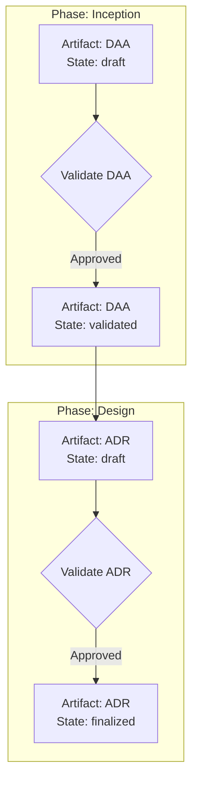
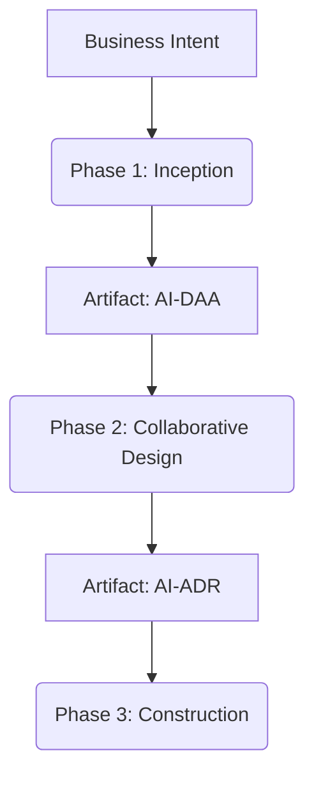
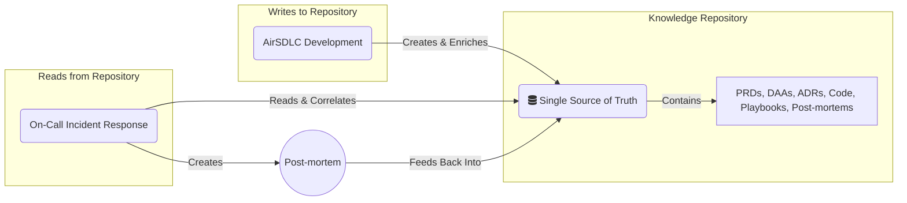
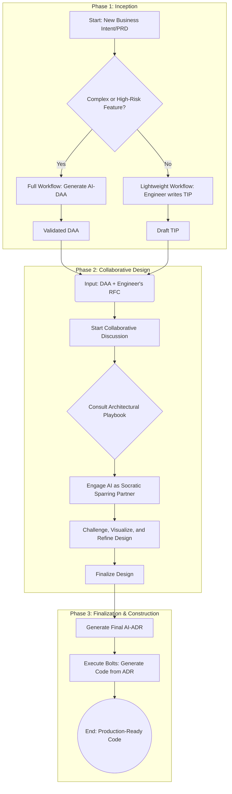
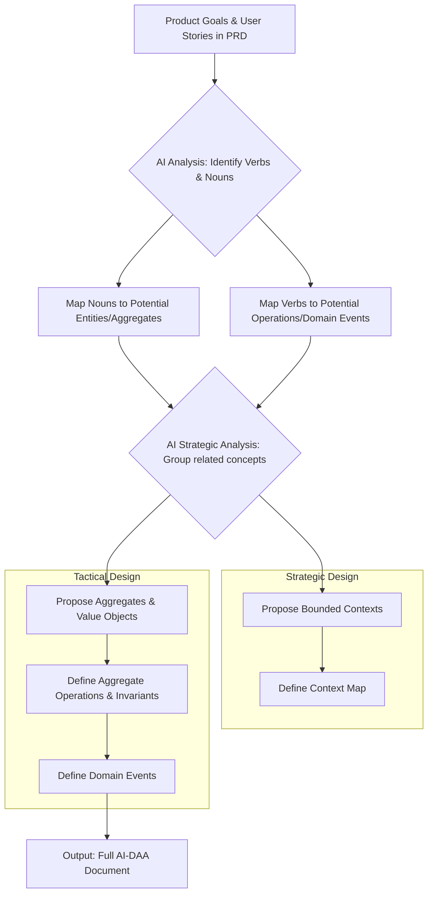
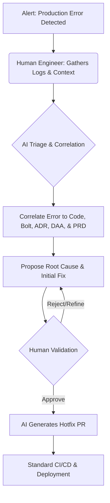

# The AirSDLC: An Actionable Framework for AI-Driven Development

> **Note**: This is the comprehensive, single-document reference for the AirSDLC framework. For easier navigation, the content has been split into focused chapters:
> - **[Overview](overview.md)** - Introduction and key concepts
> - **[Philosophy](philosophy.md)** - Core principles and AI-DLC foundation
> - **[Lifecycle](lifecycle.md)** - The three phases explained
> - **[Artifacts](artifacts.md)** - DAA, ADR, TIP, RFC specifications
> - **[Workflow](workflow.md)** - Step-by-step process and rituals
> - **[Operations](operations.md)** - Post-deployment and incident handling
> - **[Extensibility](extensibility.md)** - How to adapt and extend
> - **[Examples](examples/README.md)** - Sample artifacts and use cases

---

## Introduction & Philosophy

### My Journey
This document formalizes a series of successful experiments in applying a structured, AI-driven lifecycle to real-world software projects. Starting with the theoretical concepts of the AI-Driven Development Lifecycle (AI-DLC), I developed a practical workflow that demonstrated remarkable success in bridging the gap between ambiguous business requirements and production-ready architectural decisions. This framework, the "AI-Responsible Software Development Lifecycle" (AirSDLC), is the codification of that proven process.

### Core Principle
AirSDLC is built on the core AI-DLC paradigm: **AI-Driven Execution with Human Oversight**.

In this model, the AI is not merely an assistant or a code-completion tool. It is a central collaborator that generates plans, models domains, and proposes solutions. The human expert's role is elevated from a generator of artifacts to a **validator, curator, and strategic decision-maker**. Our primary cognitive load is shifted from creation to evaluation—a much higher-leverage activity.

### The Goal
The goal of AirSDLC is to provide a practical, repeatable methodology that creates a fully traceable, high-fidelity chain from initial business intent to a final, actionable architectural decision record.

---

## Core AI-DLC Principles: The Foundation of AirSDLC

The AirSDLC is a practical and actionable implementation of the theoretical AI-DLC framework. To ensure our design remains grounded in its foundational principles, this section summarizes the core concepts derived from the AI-DLC source documents. The `airsdlc` crate and its associated tools must adhere to these principles.

### **Analysis of the Core AI-DLC Framework**

Based on the provided notebooks, the AI-DLC is a complete, AI-native software development methodology designed to replace traditional SDLCs like Agile. Its philosophy is **AI-Driven, with Human-in-the-Loop Governance**. The AI is not an assistant; it is the primary executor, while humans are the validators and decision-makers.

#### **1. The Three Sequential Phases**

The framework is built on a "sequential knowledge handoff" across three distinct phases. Each phase's validated output becomes the non-negotiable input for the next.

1.  **Inception:** The "WHAT and WHY" phase. Translates an initial `Business Intent` into a locked, buildable contract.
2.  **Construction:** The "HOW" phase. Transforms the contract from Inception into tested, deployable software artifacts.
3.  **Operation:** The "MAINTAIN" phase. Deploys, monitors, and fixes the software in production, using the full context from the previous phases.

#### **2. The Core Artifacts (The "Nouns" of the Framework)**

These are the key data structures that flow through the lifecycle.

*   **Unit of Work (UOW):** The primary container for a major piece of functionality, replacing the "Epic." It is the main output of the Inception phase.
    *   **Core Composition:** Every UOW *must* contain five "problem-defining" artifacts:
        1.  PR/FAQ
        2.  User Stories
        3.  Non-Functional Requirements (NFRs)
        4.  Risk Descriptions
        5.  Measurement Criteria
    *   **Extensibility:** The framework explicitly allows for *custom artifacts* (e.g., Sequence Diagrams, Domain Models) to be added to a UOW, but the five above are the mandatory core.

*   **Bolt:** A "single workable-unit that only has a single goal," replacing the "Sprint." Bolts are the sequential, tactical steps to build a UOW, measured in hours or days.
    *   **Core Composition:** Bolts produce "solution-defining" artifacts:
        1.  Validated Logical Design & Architecture Decision Records (ADRs)
        2.  Generated Code & Comprehensive Test Suite
        3.  Deployment Unit

*   **Deployment Unit:** The final, "operations-ready" package from the Construction phase, containing code, tests, and IaC configurations.

*   **Fix-It Bolt:** A special, micro-sized Bolt generated by the AI for bug fixing during the Operation phase. It follows a structured process of RCA, proposal, validation, and execution.

#### **3. The Core Rituals (The "Verbs" of the Framework)**

These are the mandatory, synchronous "Mob" collaborations that serve as the human-in-the-loop validation gates.

1.  **Mob Elaboration (Inception):** A cross-functional team convenes to review, refine, and ultimately grant "human validation" on the AI-generated draft UOW. The output is a **"Validated Unit of Work."**

2.  **Mob Construction (Construction):** A technical team convenes to review and validate the AI's proposed architecture and ADRs for a specific Bolt *before* any code is generated. The output is a **"Validated Logical Design & ADRs."**

3.  **Continuous Oversight (Operation):** An ongoing series of expedited validation rituals where the human mob provides the final "go/no-go" decision on any AI-proposed action that would change the production environment (e.g., deploying a new `Deployment Unit` or a `Fix-It Bolt`).

#### **4. The Foundational Interaction Loop**

Underpinning everything is a repeating, four-stage cycle that defines the human-AI partnership:

1.  **[AI] Propose & Decompose:** The AI analyzes an input and creates a detailed plan/artifact.
2.  **[AI -> Human] Clarify & Question:** The AI actively seeks context and defers critical decisions.
3.  **[Human] Validate & Direct:** The "Mob" provides judgment, makes decisions, and gives approval.
4.  **[AI] Implement & Update:** Only after validation, the AI executes the plan and generates the final artifacts.

---

## The AirSDLC as an Extensible Framework

While this document describes a specific, opinionated workflow for software development, the `AirSDLC` itself is designed as an abstract, extensible framework. It is a specification for a **workflow engine** that can be implemented by higher-level tools and extended by engineers to fit their specific needs.

Any tool that implements this framework must adhere to its core concepts and state machine, ensuring a consistent and predictable process.

### Core Abstract Concepts

An `AirSDLC` implementation is built on four fundamental concepts:

*   **`Phase`**: A distinct stage of the lifecycle with a clear objective (e.g., Inception, Design).
*   **`Artifact`**: A structured data object that serves as the input or output of a `Phase` (e.g., `AI-DAA`, `AI-ADR`). Each artifact has a defined schema.
*   **`State`**: The status of an `Artifact` within the workflow (e.g., `draft`, `review`, `validated`, `finalized`).
*   **`Transition`**: An action that changes the `State` of an `Artifact`, moving it from one `Phase` to the next.

### The Workflow as a State Machine

At its core, the `AirSDLC` is a state machine that operates on `Artifacts`. A workflow engine is responsible for managing the state of these artifacts and executing the transitions between them.



### Extension Points

The framework is designed to be extensible. A compliant workflow engine should provide mechanisms for users to add custom functionality through well-defined "extension points":

1.  **Custom Artifacts**: Engineers can define their own `Artifact` types with custom schemas. For example, a team could introduce a `SecurityReview` artifact required before the `Construction` phase.
2.  **Custom Templates**: The generation of any `Artifact` should be driven by a template. The engine should allow users to override default templates or register new ones for their custom artifacts. This allows for tailoring the output to specific team standards or languages.
3.  **Lifecycle Hooks**: The engine should expose hooks at critical points in the state machine (e.g., `pre-validation`, `post-transition`). Plugins can listen for these hooks to inject custom logic, such as sending a notification to Slack, running a compliance check, or archiving an artifact.

By adhering to this abstract framework, implementation tools can provide a robust and predictable core experience while still offering the flexibility for teams to adapt the process to their unique requirements. The remainder of this document describes the **default, reference implementation** of this framework.

---

## The AirSDLC Lifecycle: An Overview

The AirSDLC is a sequential knowledge handoff, where each phase enriches the context for the next, ensuring that technical decisions are always grounded in the business domain.



### Phase 1: Inception (The "What")
The objective of this phase is to translate an ambiguous business goal into a pure, technology-agnostic, and validated model of the business domain.

### Phase 2: Collaborative Design (The "How")
This phase is a human-AI collaborative ritual designed to synthesize the "what" from the Inception phase with the "how" of a technical implementation, resulting in a robust architectural decision.

### Phase 3: Construction & Operation
This phase uses the final architectural decision to generate, test, and deploy the code, and then provides context-aware monitoring in production.

---

## The Knowledge Repository: The Single Source of Truth

The primary output of the AirSDLC is not just code, but a living, interconnected **Knowledge Repository**. This repository serves as the "single source of truth" for the entire system, documenting the full lifecycle of every feature from business intent to technical implementation.

It is the central "brain" that enables end-to-end traceability, facilitates AI-driven analysis and code generation, and provides the foundational context for the AI-augmented on-call process described in the operational playbook.

### The Virtuous Cycle of Knowledge

The following diagram illustrates the central role of the Knowledge Repository. The AirSDLC development workflow continuously **writes to** and enriches the repository. In contrast, the operational workflows (like on-call incident response) primarily **read from** the repository to gain context and accelerate resolution. This creates a virtuous cycle where design decisions inform operations, and operational learnings (as Post-mortems) are fed back into the repository to inform future design.



### Core Components

The repository contains all artifacts generated by the AirSDLC and subsequent operations:

- **Product Requirements Documents (PRDs):** The "why" from a business perspective.
- **Domain Architecture Analyses (AI-DAAs):** The "what" of the business logic.
- **Requests for Comments (RFCs):** The forum for collaborative design.
- **Architectural Decision Records (AI-ADRs):** The "how" of the technical implementation.
- **Architectural Playbooks:** The library of standard solutions to common problems.
- **Bolts / Bolt Execution Logs:** A record of all implemented features and their corresponding code commits.
- **Post-mortems:** A searchable library of past incidents and their resolutions, closing the loop from operations back to design.

---

## The Core AirSDLC Workflow: A Step-by-Step Guide

This section provides a detailed, prescriptive guide for how to apply the AirSDLC framework, connecting the core artifacts into a cohesive, actionable workflow.

### The Workflow Diagram



### Step-by-Step Explanation

**Step 1: The Fork - Choose the Right Path**
The workflow begins with a critical decision point based on the principles of Pragmatism & Adaptability (see the "Pragmatism & Adaptability" section below).
- **Input:** A new Business Intent or Product Requirements Document (PRD).
- **Action:** The lead engineer or architect assesses the feature's context. Using the Decision Matrix described in the "Pragmatism & Adaptability" section, they determine the appropriate level of upfront modeling required.
- **Path A (Full Workflow):** For complex, high-risk, or unfamiliar domains, the process starts with generating a formal **AI-DAA**. This investment is crucial to de-risk the project.
- **Path B (Lightweight Workflow):** For simpler, well-understood features, the engineer reads the PRD and writes a **TIP (Technical Implementation Proposal)**. This is a more direct, less abstract document focusing on concrete implementation details like database schemas and API endpoints.

**Step 2: The Merge - Prepare for Collaborative Design**
The outputs of the Inception phase, whether a DAA or a TIP, are prepared as the primary input for the design discussion.
- **Action:** The engineer assembles a draft **RFC (Request for Comments)** document. This document contains the DAA or TIP, along with any initial technical ideas, constraints, or questions the engineer has.

**Step 3: The Ritual - The Collaborative Discussion**
This is the core "Mob Construction" ritual where the human architect and the AI collaborate to produce a robust design.
- **Action:** The architect initiates a session with the AI, providing the draft RFC as context.
- **Consult the Playbook:** The architect identifies the key architectural challenges (e.g., data consistency, service communication) and consults the **Architectural Playbook** (described under "The Core Artifacts of AirSDLC") for established patterns and solutions.
- **Engage the Sparring Partner:** The architect prompts the AI to act as a **"Socratic Sparring Partner."** Using the patterns from the Playbook, the architect directs the AI to challenge the design, propose alternatives, and analyze trade-offs. This is an iterative loop of questioning, generating diagrams-as-code to clarify thinking, and refining the design until it is robust and well-vetted.

**Step 4: The Record - Generate the Final AI-ADR**
Once the design is stable and all major risks have been addressed, the decisions are codified.
- **Action:** The architect prompts the AI to generate the final **AI-ADR (Architectural Decision Record)**. This document is the immutable source of truth for the implementation, capturing the final architecture, the rationale behind the decisions, and the trade-offs that were accepted.

**Step 5: The Build - Execute "Bolts"**
The ADR is now an executable specification.
- **Action:** The project is broken down into **"Bolts"** (as defined in the "Integrating AI-DLC Rituals" section), where each Bolt represents a discrete piece of the ADR (e.g., "implement the `cancel_booking` endpoint"). The engineer prompts the AI to generate the boilerplate code, tests, and configurations for one Bolt at a time, focusing their own energy on implementing the core, complex business logic.

---

## The Core Artifacts of AirSDLC

### The AI-DAA (Domain Architecture Analysis)
The AI-DAA is the cornerstone of the AirSDLC's "Full Workflow." It is a **strictly technology- and vendor-agnostic** blueprint of the business domain. Generated by the AI from the structured PRD, it is a 100% pure pseudo-abstraction of the business logic. It contains **no specific technical solutions**: no databases, no frameworks, and no programming languages. Its primary purpose is to ensure a deep, shared understanding of the problem space *before* any technical solutions are considered. A single, well-formed DAA can be implemented in any number of ways—for example, as a Python-based monolith or as a set of Golang-based microservices.

#### Why Domain-Driven Design (DDD)?
The AirSDLC adopts DDD as its foundational modeling methodology for several key reasons:
- **Focus on Business Domain:** DDD places the primary focus on the core business logic. It provides a set of tools for tackling complexity in the heart of the software.
- **Shared Understanding (Ubiquitous Language):** DDD insists on a common, rigorous language shared between domain experts, product managers, and developers. This "Ubiquitous Language" reduces ambiguity and ensures everyone is talking about the same concepts.
- **Strategic Boundaries:** DDD provides patterns (like Bounded Contexts and Context Maps) to strategically break down a large, complex system into smaller, more manageable, and loosely coupled parts. This is essential for building scalable and maintainable software.
- **AI-Friendliness:** The structured and explicit nature of DDD artifacts (Aggregates, Entities, Value Objects, Domain Events) makes it an ideal methodology for an AI to work with. The AI can be trained to identify and generate these patterns from a well-structured PRD.

#### The DAA Generation Process
The AI-DAA is the result of a systematic mapping process, executed by the AI, that translates product goals into DDD patterns.



1.  **Analysis of the PRD:** The AI first parses the structured PRD, identifying the key "nouns" (e.g., "Booking," "Room," "User," "Reservation") and "verbs" (e.g., "reserve," "cancel," "confirm," "check-in").
2.  **Strategic Design (The Big Picture):** The AI groups related concepts to propose logical boundaries (`Bounded Contexts`) and defines the relationships between them (`Context Map`).
3.  **Tactical Design (The Details):** Within each context, the AI applies tactical DDD patterns, identifying `Aggregates`, `Entities`, `Value Objects`, and modeling the "verbs" as `Operations` with `Invariants` and `Domain Events`.

#### The DAA as an Executable Specification
The final AI-DAA document, with its detailed pseudocode, serves as a precise, executable specification for the business logic. Because it is **100% technology-agnostic**, it is structurally rigorous but maximally flexible, making it the perfect input for the next phase where concrete technical decisions will be applied.

*Example Snippet: An Aggregate from a DAA*
```pseudocode
AGGREGATE: Booking
  AGGREGATE_ROOT: Booking
    IDENTITY: booking_id (UUID)
    
    ATTRIBUTES:
      user_id: UserID
      room_id: RoomID
      status: BookingStatus (value object)
      time_slot: TimeSlot (value object, with start_time and end_time)
    
    INVARIANTS:
      - Booking status must follow valid state machine transitions.
      - Only confirmed bookings can be cancelled.
      - A room cannot have overlapping bookings for the same time slot.
      - Completed bookings are terminal.
    
    OPERATIONS:
      cancel(reason: String) → BookingCancelled
        PRECONDITION: status = confirmed
        POSTCONDITION: status = cancelled
        DOMAIN_EVENT: BookingCancelled
```

### The Architectural Playbook
The Architectural Playbook is a living document that serves as the codified architectural wisdom of an engineering organization. It is a curated library of approved solutions to common, recurring cross-cutting concerns. Its primary purpose is to empower the AI to be a more effective "Socratic Sparring Partner" during the Collaborative Design phase.

- **Purpose:** To ensure consistency, share knowledge, and accelerate design by providing a set of vetted, reusable patterns. It is the "how" to the "what" of a high-level technical strategy.

- **Structure of a Playbook Entry:** Each pattern in the playbook should be a self-contained guide with a clear, consistent structure:
    - **Pattern:** A descriptive name (e.g., "Transactional Outbox Pattern," "Idempotent API Endpoint Design").
    - **Problem:** A clear description of the recurring problem this pattern solves (e.g., "How to guarantee atomicity between a database write and an asynchronous message publish?").
    - **Context:** When is this pattern applicable? What are the prerequisites? When should it *not* be used?
    - **Solution:** A detailed description of the implementation, often including diagrams-as-code.
    - **Checklist for Edge Cases:** A list of critical details to consider during implementation (e.g., "How will the message relay handle poison pills? What monitoring is required for the outbox table size?").
    - **Trade-offs:** An honest assessment of the pros (e.g., "Guarantees at-least-once delivery") and cons (e.g., "Increases implementation complexity, introduces potential for message latency").

- **Benefits:**
    - **Consistency:** Ensures all teams solve common problems in the same, approved way.
    - **Knowledge Sharing:** Captures senior engineering expertise in a format that is accessible to all, including the AI.
    - **Empowers the AI:** Provides a high-quality, curated knowledge base that the AI can use to challenge designs and suggest well-vetted alternatives, significantly improving the quality of the human-AI collaboration.

### TIP vs. RFC: From Proposal to Peer Review
A **TIP (Technical Implementation Proposal)** is the engineer's initial, self-generated proposal for how to build a feature. It is the starting point for the Lightweight Workflow. An **RFC (Request for Comments)** is the formal document used for collaborative review and refinement; it is the forum for the design discussion.

A TIP is often the *seed* that grows into an RFC.

| Aspect | **TIP (Technical Implementation Proposal)** | **RFC (Request for Comments)** |
| :--- | :--- | :--- |
| **Author** | A single engineer. | Collaborative. Starts with a TIP or DAA, then refined by the team. |
| **Purpose** | To be an engineer's first-pass design draft; their initial thoughts on "how." | To solicit feedback and drive discussion toward a final, approved design. |
| **Scope** | Represents one perspective. Often a "brain dump" of schema, APIs, etc. | A more formal document that incorporates wider architectural constraints (ADRs). |
| **Analogy** | An engineer's detailed personal notes or a **draft proposal**. | The official document circulated for **peer review**. |
| **Workflow Step**| An **input** to the design process. | The **forum** for the design process. |

#### Example Use Case: The Journey of a Feature
Let's trace a simple "Booking Notes" feature in the **Lightweight Workflow**.

1.  **The PRD:** A new PRD arrives: "As a user, I want to add notes to my booking so I can remember special requests."

2.  **The Engineer's TIP:** The engineer decides this is a simple feature and creates a `TIP` to structure their thoughts.
    *   **`add_booking_notes_tip.md` (Excerpt):**
        > **DB Change:** Add a `notes TEXT` column to the `bookings` table.
        > **API Endpoint:** `PUT /v1/bookings/{booking_id}/notes`
        > **Validation:** Notes must be 0-500 characters.
        > **Question:** Do we need to audit-log notes changes?

3.  **The Draft RFC:** The engineer formalizes this by creating `RFC-002_Booking_Notes.md`. They copy the TIP into the "Proposed Implementation" section and add the other standard RFC sections. The "Open Questions" section now includes the auditing question.

4.  **The Collaborative Review (RFC stage):** The RFC is shared with the team and the AI.
    *   A teammate comments: "Good point on auditing. Given our compliance rules, we should add an `audit_events` table."
    *   The architect prompts the AI: *"Review this RFC. Does the proposed `PUT` endpoint align with our API standards in the Playbook?"*
    *   The AI responds: *"Our Playbook prefers `PATCH` for partial updates to align with JSON Patch standards (RFC 6902). Consider changing to `PATCH /v1/bookings/{booking_id}`."*

5.  **The Final RFC & ADR:** The engineer updates the RFC with the feedback. This refined design is approved, and the key decisions are recorded in a new `AI-ADR`. The feature is now ready for construction.

### The AI-ADR (Architectural Decision Record)
The AI-ADR is the final, immutable output of the Collaborative Design phase. It is more than just a document; it is the **executable specification for the technical implementation**. Generated by the AI after the "Socratic Sparring" session is complete, it represents the consensus reached between the engineer's proposal, the AI's challenges, and the guidance from the Architectural Playbook.

#### Purpose and Value
- **Clarity and Alignment:** It provides a single source of truth for the development team on *how* a system should be built, eliminating ambiguity before implementation begins.
- **Traceability:** Crucially, it links the chosen technical solution directly back to the business requirements in the DAA. Each decision should be justifiable in the context of the domain model.
- **Onboarding and Knowledge Sharing:** ADRs serve as a historical record of the project's architectural evolution. New team members can read them to quickly understand not just *what* was built, but *why* it was built that way.
- **Input for Construction:** The AI-ADR is the direct input for the AI during the Construction phase. Its structured nature allows the AI to generate code, tests, and infrastructure configurations with high fidelity.

#### Structure of an AI-ADR
An AI-ADR should be a clear, structured document. The AI can be prompted to generate it using a standard template:

- **Title:** A descriptive name for the decision (e.g., "ADR-003: Asynchronous Event-Driven Communication for User Notifications").
- **Status:** Proposed, Accepted, Deprecated.
- **Context:** What is the problem or feature we are designing? (This section should link directly to the relevant parts of the DAA or PRD).
- **Decision:** A clear and concise statement of the chosen architectural approach.
    - *Example:* "We will implement a Transactional Outbox Pattern to ensure reliable, at-least-once delivery of `BookingConfirmed` events to a Kafka topic. The `Notification` service will be the consumer."
- **Rationale & Trade-offs:** This is the most important section. It explains *why* this decision was made and what alternatives were considered.
    - *Example:* "A synchronous API call was considered but rejected due to the risk of tight coupling and cascading failures (as identified in the Collaborative Discussion). While the Outbox pattern adds implementation complexity, the requirement for guaranteed notification delivery outweighs this cost. The trade-off of potential message latency is acceptable for this use case."
- **Implementation Details:** High-level details for the construction phase, such as database schema changes, API contracts, or diagrams-as-code illustrating the final flow.

#### The ADR as an "Executable Spec"
The AI-ADR is not just documentation that gets filed away. Because it is so structured and detailed, it becomes the direct specification for the AI in the next phase. The engineer can take a specific part of the ADR (like an API contract) and prompt the AI: *"Based on this ADR, generate the Go boilerplate for this API handler."* This makes the ADR a living, executable artifact that directly guides code generation.

---

## Pragmatism & Adaptability
The AirSDLC is not a rigid, one-size-fits-all process. The level of ceremony should match the complexity and risk of the feature being built. The goal is to invest time where it yields the highest return in clarity and quality.

### The Hybrid Model: Smart Selectivity
Based on the context (feature complexity, team maturity, timeline), choose the appropriate workflow:

- **For Simple/Well-Understood Features:** A **Lightweight Workflow** is often sufficient. The engineer reads the PRD and writes a **TIP (Technical Implementation Proposal)** directly. The formal DAA is skipped, but the process is still structured.
- **For Complex/Unfamiliar Features:** The **Full Workflow** (including the AI-DAA) is recommended to de-risk the project and ensure a deep domain understanding.
- **For Critical/High-Risk Features:** The Full Workflow is essential. The upfront investment in domain modeling and risk analysis prevents costly errors downstream.

### The Decision Matrix
Use a simple matrix to decide which path to take:

| Context | Recommended Approach |
|---|---|
| **Feature Complexity:** Simple CRUD | Lightweight (PRD → TIP → RFC) |
| **Feature Complexity:** Complex Business Logic | Full (PRD → DAA → RFC) |
| **Team Maturity:** Senior Engineers | Lightweight |
| **Team Maturity:** Junior Engineers | Full (to teach structured thinking) |
| **Timeline:** Urgent | Lightweight |
| **Timeline:** Strategic/Long-Term | Full |

---

## The Principle of Validation
While the level of upfront design can be adapted, **validation should never be skipped**. AI-driven validation is a high-leverage, low-cost safety net that should be applied in all workflow variants.

- **RFC-to-PRD Coverage:** Even in a lightweight workflow, use the AI to generate a "Coverage Report" that compares the engineer's TIP/RFC against the original PRD. This catches misunderstandings before a line of code is written.
- **Code-to-RFC Compliance:** After implementation, use the AI to generate a "Compliance Report" that verifies the final code adheres to the decisions in the ADR.

This validation-first approach ensures that even when moving fast, we are still building the *right thing* correctly.

---

## The Payoff: End-to-End Traceability

A key benefit of the AirSDLC is the creation of a fully traceable chain of artifacts. This allows for unprecedented "coverage metrics," providing clear insight into complexity, effort, and the direct link between business goals and technical strategy.

**Traceability Chain:**
`Business Goal → AI-PRD Feature → AI-DAA Aggregate/Operation → AI-ADR Technology Choice → Implementation Effort`

This chain is not just documentation; it is a machine-readable graph of the entire project. This opens up the possibility of **automated metrics and reporting**, allowing for real-time analysis of project complexity and progress.

---

## Integrating AI-DLC Rituals into the AirSDLC Workflow

The AirSDLC is a practical implementation of the theoretical AI-DLC framework. This section describes how the core AI-DLC rituals and concepts are integrated into the day-to-day AirSDLC workflow.

### The "Unit of Work" as a Validated DAA
In formal AI-DLC, the `Unit of Work (UoW)` is the primary, validated output of the Inception phase. In AirSDLC, this is concretely represented by the **Validated AI-DAA** (and its source AI-PRD). The DAA serves as the immutable technical contract and single source of truth for what needs to be built, perfectly fulfilling the role of the UoW.

### The "Mob Elaboration" Ritual
- **AI-DLC Theory:** A "mob" of stakeholders convenes to validate and refine AI-generated requirements in real-time.
- **AirSDLC Practice:** This ritual is implemented during **Phase 1: Inception**. After the AI generates the initial `AI-PRD` and `AI-DAA`, the human expert (the "mob," which can be a single architect or a small team) reviews these artifacts. The key activity is the validation and refinement of the DAA, ensuring it accurately models the business domain. This focused session replaces weeks of traditional backlog grooming and clarification meetings.

### The "Mob Construction" Ritual
- **AI-DLC Theory:** A technical "mob" reviews and validates AI-proposed architecture and code.
- **AirSDLC Practice:** This is the heart of **Phase 2: Collaborative Design**. The "mob" (the architect or senior engineer) engages the AI as a "Socratic Sparring Partner." Using the `Architectural Playbook`, the mob directs the AI to explore alternatives, identify risks, and challenge assumptions in the initial RFC. This is an active, collaborative design session that results in a robust `AI-ADR`.

### "Bolts" as Actionable ADR Components
- **AI-DLC Theory:** `Bolts` are short, focused implementation cycles measured in hours or days.
- **AirSDLC Practice:** A `Bolt` corresponds to a specific, actionable component from the finalized `AI-ADR`. For example, after the ADR for the "Room Booking System" is approved, a single Bolt could be "Implement the `POST /bookings` endpoint and its service logic." During **Phase 3: Construction**, the engineer prompts the AI to generate the code for one Bolt at a time, ensuring focus and quality.

### "Continuous Oversight" in Operations
- **AI-DLC Theory:** Humans validate the AI's operational proposals in production.
- **AirSDLC Practice:** This is implemented in the latter part of **Phase 3: Operation**. The AI uses the full traceability chain (from DAA to ADR to code) to provide context-aware monitoring. For example, if it detects a latency spike, it can correlate it to the specific NFR in the original PRD and the service defined in the ADR, allowing it to propose a highly relevant scaling action for human approval.

---

## Post-Deployment: Bug & Incident Handling
A key advantage of the AirSDLC is its ability to handle post-deployment issues with unprecedented context and speed. The end-to-end traceability established during the design phase becomes a powerful tool for debugging and resolution. The process follows the core principle of "AI-Driven Execution with Human Oversight."

### The Context-Aware Incident Response Loop
When a bug or production incident occurs, the response is not a manual scramble through logs. Instead, it's a structured, human-initiated, AI-assisted investigation that leverages the entire chain of artifacts.



**Step 1: Human-Led Triage & AI Correlation**
- **Human Action (Proactive Gathering):** The process begins with the on-call engineer. Upon receiving a production alert, the engineer's first step is to proactively gather the relevant artifacts. This includes specific error messages, relevant log snippets from the time of the incident, and the stack trace.
- **Input for AI:** The engineer provides this curated set of information to the AI.
- **AI Action (Correlation):** With this high-quality input, the AI's task becomes much more precise. It uses the stack trace to pinpoint the exact line of code and then leverages the full traceability chain:
    1.  It identifies the **"Bolt"** that produced this code during the Construction phase.
    2.  It compares the code with the intent of the Bolt and the final **AI-ADR**. This is crucial for detecting "implementation drift."
    3.  It traces the ADR back to the governing principles in the **AI-DAA** and the original **PRD** requirement.
- **Output:** The AI presents a "Triage Summary" that now includes implementation-vs-design analysis.
    - *Example:* "Based on the logs provided, the error is `DB-Constraint-Violation` in `booking_service.go:152`.
      - **Correlation:** This code was generated as part of **Bolt-007 ('Implement Booking Creation')**.
      - **Analysis:** The governing design, **ADR-002**, specifies that booking time slot uniqueness should be enforced at the database level to prevent double-booking. However, the code generated for Bolt-007 only implemented an application-level check. This mismatch between the ADR and the implementation is the likely root cause.
      - **Origin:** This requirement traces back to the **DAA invariant `A room cannot have overlapping bookings for the same time slot`**."

**Step 2: AI-Proposed Remediation**
- **AI Action:** Based on its contextual understanding, the AI proposes a holistic solution.
    - **Root Cause Analysis:** It explains the likely logical flaw (e.g., "The ADR did not specify a database-level unique constraint for overlapping time slots, relying only on an application-level check which is susceptible to race conditions.").
    - **Proposed Fix:** It suggests a code change (e.g., "Add a database constraint or exclusion constraint to prevent overlapping bookings for the same room and time slot, and update the repository code to handle the potential database error gracefully.").

**Step 3: Human Validation and Decision**
- **Human Role:** The engineer's role is to validate the AI's analysis and decision, not hunt for the problem.
- **Action:** The engineer reviews the Triage Summary and the proposed fix. They might ask the AI to refine it ("What if we handle this at the application layer with distributed locking instead?"). Once the engineer approves a course of action, they give the command to proceed.

**Step 4: AI-Generated Hotfix**
- **AI Action:** Upon approval, the AI generates a pull request containing the code changes, updates to unit tests, and an updated version of the **AI-ADR** to reflect the new architectural reality. This keeps the documentation from going stale.
- **Human Role:** The engineer reviews the PR, merges it, and monitors the deployment.

This process transforms bug handling from a reactive investigation into a structured, efficient, and context-rich review process, dramatically reducing the Mean Time To Resolution (MTTR).

---

## Operational Readiness: The On-Call Playbook

The AirSDLC framework extends beyond deployment into operations. The same principles of AI-augmentation and end-to-end traceability are applied to incident management through a dedicated **On-Call Playbook**.

The philosophy is to transform on-call from a reactive, stressful process into a structured, context-aware investigation. The on-call engineer acts as an "Incident Commander," directing the AI which serves as a powerful SRE, using the full Knowledge Repository to rapidly correlate problems and propose solutions.

This operational framework is detailed in its own document, which provides a complete guide to AI-augmented incident response, including specific runbooks for common alerts.

**For the complete framework, see the [[notebooks/ai/ai-on-call-playbook.md]].**

---

## The AirSDLC Ecosystem: From Framework to Platform

It is critical to distinguish between the **AirSDLC Framework** and the **tools** that implement it. This document describes the framework—a set of conventions, artifacts, and state-management rules. To bring this framework to life, an ecosystem of tools can be built on top of it.

This separation allows for flexibility and a phased approach to adoption. Different tools can serve different roles, all operating on the same standardized repository of artifacts.

### Future Vision: The Knowledge Hub

The long-term vision is to build a comprehensive web platform—a **Knowledge Hub**—that consumes the artifacts produced by implementation tools. This Hub would serve as the central nervous system for an entire engineering organization, providing:

-   **Visual Knowledge Graph Exploration:** Allowing anyone from a PM to an on-call engineer to trace the full lifecycle of a feature.
-   **AI-Enhanced Collaboration:** Facilitating design reviews and team coordination with an AI as an active participant.
-   **Portfolio and Project Management:** Offering a true, AI-native alternative to traditional project management tools like Jira by providing automated status tracking, AI-powered forecasting, and high-level roadmap planning.

This platform represents the ultimate goal: a fully integrated environment that replaces the friction of the traditional software development lifecycle with an intelligent, streamlined, and knowledge-centric workflow.

