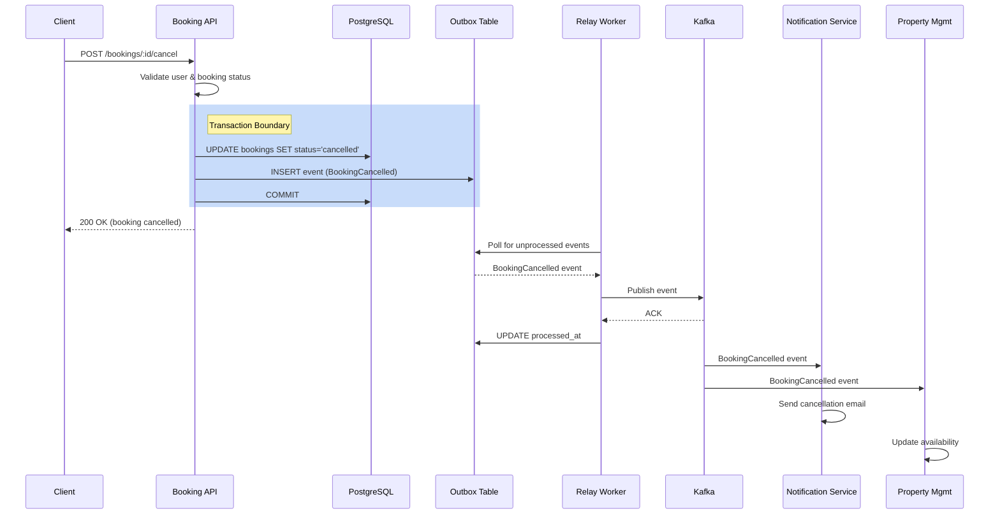

# ADR-023: Booking Cancellation Implementation Architecture

**Status**: Accepted  
**Author**: Jane Smith (Senior Engineer)  
**Reviewers**: Engineering Team, Architecture Board  
**Decision Date**: 2024-01-25  
**Supersedes**: None  

**Related Documents**:
- **PRD**: PRD-015 (Booking Cancellation Feature)
- **DAA**: AI-DAA Booking Cancellation Domain Model
- **RFC**: RFC-023 (Booking Cancellation Implementation)

---

## 1. Context and Problem Statement

Users currently cannot cancel their bookings through the application, requiring them to contact customer support. This results in high support costs (60% of tickets are cancellation requests) and poor user experience.

The booking cancellation feature needs to:
1. Allow users to self-service cancel their confirmed bookings
2. Meet strict reliability requirements (99.9% uptime, zero event loss)
3. Maintain performance standards (p95 latency < 500ms)
4. Ensure reliable notification delivery to downstream services
5. Handle high concurrency (1000 concurrent requests, 50,000 cancellations/day)

### Key Technical Challenges
- **Reliability**: How to guarantee event delivery to downstream services even during failures?
- **Consistency**: How to ensure atomicity between database updates and event publishing?
- **Concurrency**: How to handle race conditions from multiple simultaneous cancellation attempts?
- **Performance**: How to meet latency SLAs while maintaining reliability?

---

## 2. Decision Drivers

### Functional Requirements (from PRD-015)
- Users can cancel confirmed bookings via REST API
- Cancellation reason must be provided
- System sends notifications to user and property owner
- Cancelled bookings remain in history for 12+ months

### Non-Functional Requirements
- **NFR-015-1**: API response time < 500ms (p95)
- **NFR-015-2**: Notification delivery within 30 seconds
- **NFR-015-3**: 99.9% uptime for cancellation endpoint
- **NFR-015-4**: Zero data loss for cancellation events
- **NFR-015-5**: Guaranteed notification delivery (at-least-once)
- **NFR-015-9**: Support 1000 concurrent cancellation requests

### Technical Constraints
- Existing microservices architecture (Go-based)
- PostgreSQL database for booking state
- Kafka for event streaming
- Multiple downstream consumers (Notification, Property Management)

---

## 3. Considered Options

### Option 1: Synchronous Event Publishing (Direct Kafka Publish)

**Architecture**:
```
API Handler → Database Update → Kafka Publish → Return Response
```

**Pros**:
- Simple implementation
- No additional infrastructure
- Immediate event delivery

**Cons**:
- ❌ Violates atomicity - if Kafka is down, booking is cancelled but event is lost
- ❌ Increases API latency (Kafka publish blocks response)
- ❌ Does not meet NFR-015-4 (zero data loss)
- ❌ Single point of failure

**Verdict**: REJECTED - Does not meet reliability requirements

---

### Option 2: Transactional Outbox Pattern (SELECTED)

**Architecture**:
```
API Handler → Database + Outbox Write (Transaction) → Return Response
Outbox Worker → Poll Outbox → Kafka Publish → Mark Processed
```

**Pros**:
- ✅ Guarantees atomicity (database + outbox in same transaction)
- ✅ Zero event loss (events persisted before acknowledgment)
- ✅ Fast API response (async event publishing)
- ✅ Resilient to Kafka downtime
- ✅ Meets all reliability NFRs

**Cons**:
- Additional complexity (outbox table + relay worker)
- Eventual consistency (slight delay in event delivery)
- Requires monitoring of outbox backlog

**Verdict**: SELECTED - Best balance of reliability and performance

---

### Option 3: Saga Pattern with Orchestration

**Architecture**:
```
API → Saga Orchestrator → Database → Notification Service → PMS
```

**Pros**:
- Strong consistency guarantees
- Explicit compensation logic

**Cons**:
- ❌ Massive overkill for one-way cancellation operation
- ❌ High implementation complexity
- ❌ Increased latency
- ❌ Not needed - no distributed transaction required

**Verdict**: REJECTED - Over-engineered for this use case

---

### Option 4: Two-Phase Commit (2PC)

**Architecture**:
```
API → 2PC Coordinator → Database + Kafka (distributed transaction)
```

**Pros**:
- Strong consistency

**Cons**:
- ❌ High latency (blocking protocol)
- ❌ Kafka doesn't support 2PC
- ❌ Single point of failure (coordinator)
- ❌ Poor scalability

**Verdict**: REJECTED - Not feasible with existing tech stack

---

## 4. Decision Outcome

### Selected: Transactional Outbox Pattern (Option 2)

We will implement the booking cancellation feature using the **Transactional Outbox Pattern** with the following architecture:



---

## 5. Implementation Details

### 5.1 Database Schema

#### Bookings Table Modifications

```sql
-- Add cancellation fields to existing bookings table
ALTER TABLE bookings 
  ADD COLUMN cancelled_at TIMESTAMP NULL,
  ADD COLUMN cancellation_reason VARCHAR(50) NULL,
  ADD COLUMN cancellation_notes TEXT NULL,
  ADD COLUMN version INTEGER NOT NULL DEFAULT 1;

-- Enforce enum constraint for cancellation reason
ALTER TABLE bookings
  ADD CONSTRAINT check_cancellation_reason 
  CHECK (cancellation_reason IN (
    'change_of_plans', 'double_booking', 
    'found_alternative', 'no_longer_needed', 'other'
  ));

-- Enforce data consistency: if cancelled, reason must exist
ALTER TABLE bookings
  ADD CONSTRAINT check_cancellation_consistency
  CHECK (
    (status = 'cancelled' AND cancellation_reason IS NOT NULL AND cancelled_at IS NOT NULL) OR
    (status != 'cancelled' AND cancellation_reason IS NULL AND cancelled_at IS NULL)
  );

-- Add index for cancelled bookings queries
CREATE INDEX idx_bookings_cancelled_at ON bookings(cancelled_at) 
  WHERE cancelled_at IS NOT NULL;

-- Add index for version-based optimistic locking
CREATE INDEX idx_bookings_version ON bookings(id, version);
```

#### Outbox Table

```sql
-- Transactional outbox table for reliable event publishing
CREATE TABLE booking_outbox (
  id BIGSERIAL PRIMARY KEY,
  booking_id UUID NOT NULL,
  event_type VARCHAR(100) NOT NULL,
  event_payload JSONB NOT NULL,
  created_at TIMESTAMP NOT NULL DEFAULT NOW(),
  processed_at TIMESTAMP NULL,
  retry_count INTEGER NOT NULL DEFAULT 0,
  last_error TEXT NULL
);

-- Index for efficient polling of unprocessed events
CREATE INDEX idx_outbox_unprocessed 
  ON booking_outbox(created_at) 
  WHERE processed_at IS NULL;

-- Index for monitoring and cleanup
CREATE INDEX idx_outbox_processed 
  ON booking_outbox(processed_at) 
  WHERE processed_at IS NOT NULL;
```

---

### 5.2 API Contract

```http
POST /v1/bookings/{booking_id}/cancel
Authorization: Bearer <jwt_token>
Content-Type: application/json

Request Body:
{
  "reason": "change_of_plans",  // Required: one of enum values
  "notes": "Found a better option"  // Optional: free text
}

Response 200 OK:
{
  "booking_id": "a1b2c3d4-5678-90ab-cdef-1234567890ab",
  "user_id": "user-123",
  "resource_id": "resource-456",
  "status": "cancelled",
  "cancelled_at": "2024-01-25T14:30:00Z",
  "cancellation_reason": "change_of_plans",
  "cancellation_notes": "Found a better option",
  "confirmation_code": "A1B2C3D4"
}

Error Responses:
- 400 Bad Request: Invalid reason or booking cannot be cancelled
  {"error": "INVALID_STATUS", "message": "Cannot cancel booking with status 'completed'"}
  
- 403 Forbidden: User does not own booking
  {"error": "UNAUTHORIZED", "message": "You do not own this booking"}
  
- 404 Not Found: Booking not found
  {"error": "NOT_FOUND", "message": "Booking not found"}
  
- 409 Conflict: Concurrent modification detected
  {"error": "CONFLICT", "message": "Booking was modified by another request. Please retry."}
  
- 500 Internal Server Error: System failure
  {"error": "INTERNAL_ERROR", "message": "An unexpected error occurred"}
```

---

### 5.3 Service Implementation

```go
// BookingService.CancelBooking implements the cancellation operation
func (s *BookingService) CancelBooking(
  ctx context.Context,
  bookingID uuid.UUID,
  userID uuid.UUID,
  reason CancellationReason,
  notes string,
) (*Booking, error) {
  
  // Start database transaction
  tx, err := s.db.BeginTx(ctx, &sql.TxOptions{
    Isolation: sql.LevelReadCommitted,
  })
  if err != nil {
    return nil, fmt.Errorf("begin transaction: %w", err)
  }
  defer tx.Rollback()
  
  // Load booking with row-level lock (SELECT FOR UPDATE)
  booking, err := s.repo.FindByIDForUpdate(ctx, tx, bookingID)
  if err != nil {
    if errors.Is(err, ErrNotFound) {
      return nil, ErrBookingNotFound
    }
    return nil, fmt.Errorf("find booking: %w", err)
  }
  
  // Authorization: Verify user owns the booking
  if booking.UserID != userID {
    return nil, ErrUnauthorizedCancellation
  }
  
  // Validation: Check booking status
  if booking.Status != StatusConfirmed {
    return nil, ErrInvalidBookingStatus
  }
  
  // Update booking state (domain logic)
  now := time.Now()
  booking.Status = StatusCancelled
  booking.CancelledAt = &now
  booking.CancellationReason = &reason
  booking.CancellationNotes = &notes
  booking.Version++ // Optimistic locking
  
  // Persist booking changes
  if err := s.repo.Update(ctx, tx, booking); err != nil {
    if errors.Is(err, ErrVersionConflict) {
      return nil, ErrConcurrentModification
    }
    return nil, fmt.Errorf("update booking: %w", err)
  }
  
  // Create domain event
  event := BookingCancelledEvent{
    EventID:           uuid.New(),
    BookingID:         booking.ID,
    UserID:            booking.UserID,
    ResourceID:        booking.ResourceID,
    ConfirmationCode:  booking.ConfirmationCode,
    CancelledAt:       now,
    Reason:            reason,
    Notes:             notes,
    OccurredAt:        now,
  }
  
  // Write event to outbox (in same transaction)
  if err := s.outbox.Insert(ctx, tx, OutboxEntry{
    BookingID:    booking.ID,
    EventType:    "BookingCancelled",
    EventPayload: event.ToJSON(),
  }); err != nil {
    return nil, fmt.Errorf("insert outbox event: %w", err)
  }
  
  // Commit transaction (atomically updates booking + outbox)
  if err := tx.Commit(); err != nil {
    return nil, fmt.Errorf("commit transaction: %w", err)
  }
  
  // Log cancellation for audit
  s.logger.Info("booking cancelled",
    "booking_id", booking.ID,
    "user_id", userID,
    "reason", reason,
  )
  
  return booking, nil
}
```

---

### 5.4 Outbox Relay Worker

```go
// OutboxRelayWorker polls the outbox table and publishes events to Kafka
type OutboxRelayWorker struct {
  outbox    OutboxRepository
  kafka     KafkaProducer
  logger    Logger
  pollRate  time.Duration // 5 seconds
  batchSize int           // 100 events per batch
}

func (w *OutboxRelayWorker) Run(ctx context.Context) error {
  ticker := time.NewTicker(w.pollRate)
  defer ticker.Stop()
  
  for {
    select {
    case <-ctx.Done():
      return ctx.Err()
    case <-ticker.C:
      if err := w.processOutbox(ctx); err != nil {
        w.logger.Error("outbox processing failed", "error", err)
      }
    }
  }
}

func (w *OutboxRelayWorker) processOutbox(ctx context.Context) error {
  // Fetch unprocessed events (oldest first)
  events, err := w.outbox.FetchUnprocessed(ctx, w.batchSize)
  if err != nil {
    return fmt.Errorf("fetch unprocessed events: %w", err)
  }
  
  if len(events) == 0 {
    return nil // No events to process
  }
  
  w.logger.Info("processing outbox events", "count", len(events))
  
  for _, event := range events {
    if err := w.publishEvent(ctx, event); err != nil {
      // Log error but continue processing other events
      w.logger.Error("failed to publish event",
        "event_id", event.ID,
        "booking_id", event.BookingID,
        "error", err,
      )
      
      // Update retry count and error message
      w.outbox.IncrementRetryCount(ctx, event.ID, err.Error())
      
      // Move to dead-letter queue after 5 retries
      if event.RetryCount >= 5 {
        w.logger.Error("event moved to DLQ", "event_id", event.ID)
        w.outbox.MoveToDLQ(ctx, event.ID)
      }
      
      continue
    }
    
    // Mark event as processed
    if err := w.outbox.MarkProcessed(ctx, event.ID); err != nil {
      w.logger.Error("failed to mark event processed",
        "event_id", event.ID,
        "error", err,
      )
    }
  }
  
  return nil
}

func (w *OutboxRelayWorker) publishEvent(ctx context.Context, event OutboxEntry) error {
  // Publish to Kafka with retries
  message := kafka.Message{
    Topic: "booking-events",
    Key:   event.BookingID.String(),
    Value: event.EventPayload,
    Headers: []kafka.Header{
      {Key: "event_type", Value: []byte(event.EventType)},
      {Key: "event_id", Value: []byte(uuid.New().String())},
    },
  }
  
  // Kafka publish with timeout
  publishCtx, cancel := context.WithTimeout(ctx, 10*time.Second)
  defer cancel()
  
  if err := w.kafka.Produce(publishCtx, message); err != nil {
    return fmt.Errorf("kafka publish: %w", err)
  }
  
  w.logger.Info("event published to kafka",
    "event_id", event.ID,
    "booking_id", event.BookingID,
    "event_type", event.EventType,
  )
  
  return nil
}
```

---

### 5.5 Concurrency Control

#### Strategy: Optimistic Locking with Version Column

- Add `version` column to bookings table
- Increment version on every update
- UPDATE query includes WHERE clause with current version
- If affected rows = 0, version conflict detected → return 409 Conflict

```sql
-- Optimistic locking in UPDATE query
UPDATE bookings 
SET 
  status = 'cancelled',
  cancelled_at = NOW(),
  cancellation_reason = $1,
  cancellation_notes = $2,
  version = version + 1
WHERE 
  id = $3 
  AND version = $4  -- Only update if version matches
RETURNING *;
```

#### Idempotency Handling

**Decision**: Cancellation API is idempotent
- If booking is already cancelled, return 200 OK with existing cancellation data
- No error, no duplicate event published
- Simplifies client retry logic

```go
// Idempotency check before processing
if booking.Status == StatusCancelled {
  // Already cancelled - return existing data (idempotent)
  return booking, nil
}
```

---

## 6. Monitoring and Observability

### 6.1 Metrics (Prometheus)

```yaml
# API Metrics
booking_cancellation_requests_total{status="success|error|conflict"} - Counter
booking_cancellation_duration_seconds - Histogram (p50, p95, p99)
booking_cancellation_errors_total{error_type} - Counter

# Outbox Metrics
booking_outbox_size - Gauge (current unprocessed events)
booking_outbox_processing_lag_seconds - Gauge (oldest unprocessed event age)
booking_outbox_events_published_total{status="success|error"} - Counter
booking_outbox_retry_count - Histogram
booking_outbox_dlq_size - Gauge (dead-letter queue size)
```

### 6.2 Alerts (Alertmanager)

```yaml
groups:
  - name: booking_cancellation
    rules:
      - alert: HighCancellationErrorRate
        expr: |
          rate(booking_cancellation_errors_total[5m]) 
          / rate(booking_cancellation_requests_total[5m]) > 0.05
        for: 5m
        annotations:
          summary: "Cancellation API error rate > 5%"
          
      - alert: CancellationLatencyHigh
        expr: |
          histogram_quantile(0.95, booking_cancellation_duration_seconds) > 0.5
        for: 5m
        annotations:
          summary: "Cancellation API p95 latency > 500ms"
          
      - alert: OutboxBacklogHigh
        expr: booking_outbox_size > 10000
        for: 10m
        annotations:
          summary: "Outbox backlog > 10k events"
          
      - alert: OutboxProcessingLag
        expr: booking_outbox_processing_lag_seconds > 60
        for: 5m
        annotations:
          summary: "Outbox processing lag > 60 seconds"
          
      - alert: OutboxDLQGrowing
        expr: increase(booking_outbox_dlq_size[1h]) > 100
        annotations:
          summary: "Dead-letter queue growing (100+ events/hour)"
```

### 6.3 Logging

```go
// Structured logging with correlation IDs
log.Info("booking cancellation requested",
  "booking_id", bookingID,
  "user_id", userID,
  "request_id", requestID,
)

log.Info("booking cancelled successfully",
  "booking_id", bookingID,
  "user_id", userID,
  "reason", reason,
  "duration_ms", elapsed,
)

log.Error("cancellation failed",
  "booking_id", bookingID,
  "error", err,
  "error_type", errorType,
)
```

### 6.4 Tracing (OpenTelemetry)

- Distributed trace from API → Database → Outbox → Kafka → Notification
- Trace cancellation flow across microservices
- Identify bottlenecks and latency sources

---

## 7. Deployment Strategy

### 7.1 Migration Plan

#### Phase 1: Database Migration (Week 1 - Monday)
```bash
# Apply schema changes (non-breaking)
./migrate apply 023_booking_cancellation
```

- Add new columns to bookings table (nullable, non-breaking)
- Create outbox table
- Create indexes
- Run in staging environment first
- Verify performance impact on existing queries

#### Phase 2: Code Deployment (Week 1 - Wednesday)
```bash
# Deploy with feature flag OFF
./deploy booking-service v2.3.0 --flag enable_booking_cancellation=false
```

- Deploy new code to production
- Feature flag keeps cancellation endpoint disabled
- Verify service health metrics

#### Phase 3: Outbox Worker Deployment (Week 1 - Thursday)
```bash
# Deploy 3 instances of outbox relay worker
./deploy booking-outbox-worker v1.0.0 --replicas=3
```

- Deploy outbox relay workers
- Verify workers are polling outbox table
- Verify Kafka connectivity

#### Phase 4: Soft Launch (Week 2 - Monday)
```bash
# Enable for 10% of users
./feature-flag enable_booking_cancellation --percentage=10
```

- Enable feature flag for 10% of traffic
- Monitor metrics closely for 24 hours
- Watch for errors, latency spikes, outbox backlog

#### Phase 5: Gradual Rollout (Week 2)
- Day 2: 25% of users
- Day 3: 50% of users
- Day 4: 100% of users

### 7.2 Rollback Plan

#### If API Issues Detected
```bash
# Instant rollback via feature flag
./feature-flag enable_booking_cancellation --percentage=0
```

#### If Database Issues Detected
```bash
# Rollback migration (safe - columns are nullable)
./migrate rollback 023_booking_cancellation
```

#### If Outbox Worker Issues Detected
```bash
# Stop outbox workers
./deploy booking-outbox-worker --replicas=0

# Events are safe in outbox table, can replay later
```

---

## 8. Testing Strategy

### 8.1 Unit Tests

```go
// Service layer tests
TestCancelBooking_Success
TestCancelBooking_AlreadyCancelled_Idempotent
TestCancelBooking_InvalidStatus_ReturnsError
TestCancelBooking_UnauthorizedUser_ReturnsError
TestCancelBooking_ConcurrentModification_ReturnsConflict
TestCancelBooking_OutboxWriteFailure_RollsBackTransaction

// Outbox worker tests
TestOutboxRelay_PublishesEvents
TestOutboxRelay_RetriesOnFailure
TestOutboxRelay_MovesToDLQAfter5Retries
```

### 8.2 Integration Tests

```go
// End-to-end tests with real database
TestE2E_CancelBooking_DatabaseAndOutbox
TestE2E_ConcurrentCancellations_NoRaceCondition
TestE2E_OutboxWorker_PublishesToKafka
```

### 8.3 Load Tests (Locust/k6)

```javascript
// Load test scenario: 1000 concurrent cancellations
export default function() {
  const bookingId = getRandomBooking();
  const response = http.post(
    `${BASE_URL}/v1/bookings/${bookingId}/cancel`,
    JSON.stringify({
      reason: 'change_of_plans',
      notes: 'Load test'
    }),
    { headers: { 'Authorization': `Bearer ${TOKEN}` } }
  );
  
  check(response, {
    'status is 200': (r) => r.status === 200,
    'latency < 500ms': (r) => r.timings.duration < 500,
  });
}
```

**Load Test Targets**:
- 1000 concurrent requests
- p95 latency < 500ms
- Error rate < 1%
- Zero data loss (all events in outbox)

---

## 9. Security Considerations

### 9.1 Authorization
- ✅ JWT token validation on every request
- ✅ User ownership verification (booking.user_id == jwt.user_id)
- ✅ No admin override without audit log

### 9.2 Input Validation
- ✅ Cancellation reason must be valid enum
- ✅ Notes field max length: 1000 characters
- ✅ SQL injection prevention (parameterized queries)

### 9.3 Audit Logging
- ✅ All cancellations logged with user_id, IP address, timestamp
- ✅ Logs retained for 12 months for compliance
- ✅ Audit log writes do not block API response

### 9.4 Rate Limiting (Future Enhancement)
- 🔄 Not implemented in MVP
- 🔄 Monitor cancellation patterns in production
- 🔄 Add rate limiting if abuse detected

---

## 10. Operational Playbook

### 10.1 Common Issues

#### Issue: Outbox backlog growing
**Symptoms**: `booking_outbox_size` metric increasing
**Diagnosis**:
```bash
# Check outbox size
SELECT COUNT(*) FROM booking_outbox WHERE processed_at IS NULL;

# Check oldest unprocessed event
SELECT MIN(created_at) FROM booking_outbox WHERE processed_at IS NULL;
```
**Resolution**:
- Scale up outbox workers: `./scale booking-outbox-worker --replicas=10`
- Check Kafka connectivity
- Check worker logs for errors

#### Issue: Dead-letter queue growing
**Symptoms**: `booking_outbox_dlq_size` metric increasing
**Diagnosis**:
```bash
# Check DLQ events
SELECT * FROM booking_outbox WHERE retry_count >= 5 LIMIT 10;
```
**Resolution**:
- Investigate event payload for malformed data
- Fix issue and manually replay events
- Update event schema if needed

#### Issue: High cancellation error rate
**Symptoms**: `booking_cancellation_errors_total` spiking
**Diagnosis**:
```bash
# Check error types
SELECT error_type, COUNT(*) 
FROM logs 
WHERE operation='cancel_booking' AND level='error' 
GROUP BY error_type;
```
**Resolution**:
- If authorization errors: check JWT validation logic
- If database errors: check connection pool health
- If conflict errors: check for UI bug causing double-clicks

---

## 11. Consequences

### Positive Consequences

✅ **Reliability**: Zero event loss guaranteed by transactional outbox
✅ **Performance**: API latency meets SLA (async event publishing)
✅ **Scalability**: Handles 1000 concurrent requests easily
✅ **Maintainability**: Clear separation of concerns (API → DB → Events)
✅ **Observability**: Comprehensive metrics, alerts, and tracing
✅ **Resilience**: System degrades gracefully (Kafka downtime doesn't break API)

### Negative Consequences

⚠️ **Complexity**: Additional infrastructure (outbox table + relay workers)
⚠️ **Eventual Consistency**: Slight delay between cancellation and notification (acceptable)
⚠️ **Operational Overhead**: Need to monitor outbox backlog and DLQ

### Mitigations for Negative Consequences

- **Complexity**: Playbook entry documents pattern for future use
- **Eventual Consistency**: SLA allows 30 seconds for notification delivery
- **Operational Overhead**: Automated alerts and runbooks reduce manual work

---

## 12. Follow-Up Actions

### Immediate (Before Production Launch)
- [x] Create runbook for outbox backlog issues
- [x] Set up Prometheus alerts
- [x] Create Grafana dashboard for cancellation metrics
- [x] Document rollback procedure
- [x] Load test with 1000 concurrent requests

### Short-term (1-2 Sprints)
- [ ] Add distributed tracing with OpenTelemetry
- [ ] Implement outbox cleanup job (delete processed events > 30 days)
- [ ] Add cancellation analytics dashboard
- [ ] Create playbook entry for Transactional Outbox Pattern

### Long-term (Future Enhancements)
- [ ] Add cancellation deadlines (e.g., can't cancel within 24h of start time)
- [ ] Add cancellation fees/penalties
- [ ] Add partial cancellations (cancel some items in booking)
- [ ] Add rate limiting per user

---

## 13. References

### Related Patterns
- **Transactional Outbox Pattern**: See `example-playbook-entry.md`
- **Optimistic Locking**: Standard concurrency control pattern
- **Idempotent API Design**: REST API best practice

### Related Documents
- **PRD-015**: Booking Cancellation Feature (Product Requirements)
- **AI-DAA**: Booking Cancellation Domain Model (Domain Analysis)
- **RFC-023**: Booking Cancellation Implementation (Technical Proposal)

### External Resources
- [Transactional Outbox Pattern](https://microservices.io/patterns/data/transactional-outbox.html) - Chris Richardson
- [Optimistic Offline Lock](https://martinfowler.com/eaaCatalog/optimisticOfflineLock.html) - Martin Fowler
- [Idempotency in APIs](https://stripe.com/docs/api/idempotent_requests) - Stripe Documentation

---

**Decision Status**: Accepted  
**Decision Date**: 2024-01-25  
**Review Date**: 2024-04-25 (3 months post-launch)  

**Approval Signatures**:
- Engineering Lead: Jane Smith ✓
- Senior Architect: Mike Johnson ✓
- DevOps Lead: Sarah Chen ✓
- Product Manager: Alex Kumar ✓
