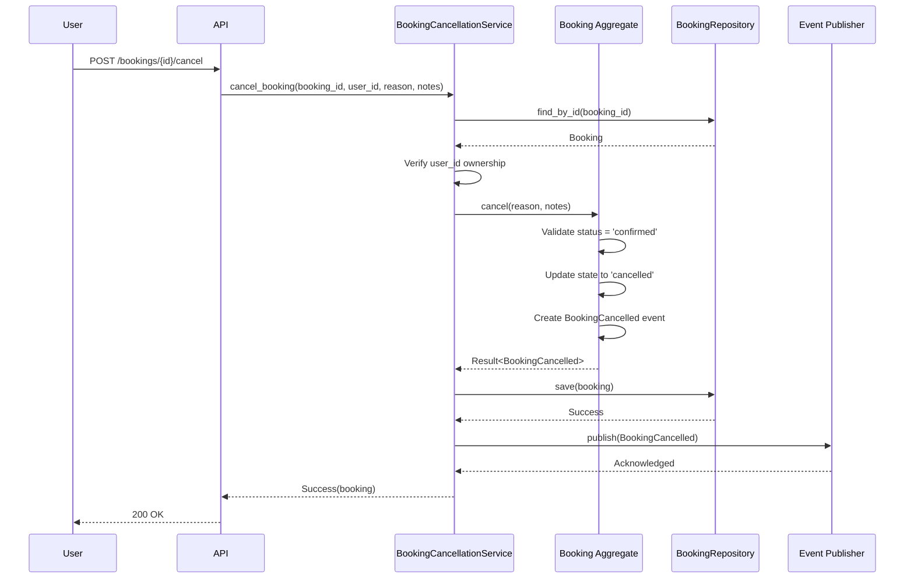

# AI-DAA: Booking Cancellation Domain Model

**Status**: Validated  
**Generated By**: AI  
**Validated By**: Engineering Team  
**Date**: 2024-01-22  
**Source PRD**: PRD-015  
**Version**: 1.0  

---

## 1. Bounded Context

### Context Name
**Booking Management Context**

### Responsibility
Manages the complete lifecycle of bookings including creation, modification, cancellation, and completion.

### Core Domain Concepts
This context is responsible for:
- Enforcing booking business rules and invariants
- Managing booking state transitions
- Publishing domain events for booking lifecycle changes
- Ensuring data consistency within the booking aggregate

---

## 2. Ubiquitous Language

### Key Terms

**Booking**: A reservation made by a user for a specific resource (room, equipment, time slot)

**Booking Status**: The current state of a booking
- `confirmed`: Active booking that can be used or cancelled
- `cancelled`: Booking that was terminated by user
- `completed`: Booking that reached its end time naturally

**Cancellation**: The act of terminating a confirmed booking before its scheduled end

**Cancellation Reason**: User-provided explanation for why the booking was cancelled

**Confirmation Code**: Unique identifier displayed to users for their booking

---

## 3. Strategic Design

### Context Map

```
┌─────────────────────────┐
│  Booking Management     │
│  (This Context)         │
└───────────┬─────────────┘
            │
            │ publishes BookingCancelled event
            ↓
┌─────────────────────────┐
│  Notification           │◄─── Downstream Consumer
│  Context                │
└─────────────────────────┘
            
            │ publishes BookingCancelled event
            ↓
┌─────────────────────────┐
│  Property Management    │◄─── External System
│  Context                │
└─────────────────────────┘
```

### Bounded Context Relationships
- **Booking Management** → **Notification** (Publisher/Subscriber)
- **Booking Management** → **Property Management** (Publisher/Subscriber)
- **User Context** → **Booking Management** (Upstream/Downstream - User provides identity)

---

## 4. Tactical Design

### Aggregate: Booking

#### Aggregate Root
**Entity**: `Booking`

**Identity**: `booking_id` (UUID)

#### Attributes

```pseudocode
AGGREGATE: Booking
  AGGREGATE_ROOT: Booking
    IDENTITY: booking_id (UUID)
    
    ATTRIBUTES:
      user_id: UserID (value object)
      resource_id: ResourceID (value object)
      status: BookingStatus (value object)
      confirmation_code: ConfirmationCode (value object)
      start_time: Timestamp
      end_time: Timestamp
      created_at: Timestamp
      cancelled_at: Timestamp (nullable)
      cancellation_reason: CancellationReason (value object, nullable)
      cancellation_notes: String (nullable)
```

#### Value Objects

**BookingStatus**
```pseudocode
VALUE_OBJECT: BookingStatus
  VALID_VALUES: confirmed | cancelled | completed
  
  INVARIANTS:
    - Value must be one of the valid values
    - Once 'cancelled' or 'completed', cannot transition to other states (terminal)
```

**CancellationReason**
```pseudocode
VALUE_OBJECT: CancellationReason
  VALID_VALUES: 
    - change_of_plans
    - double_booking
    - found_alternative
    - no_longer_needed
    - other
  
  INVARIANTS:
    - Must be one of valid values
    - Can only exist when status is 'cancelled'
```

**ConfirmationCode**
```pseudocode
VALUE_OBJECT: ConfirmationCode
  FORMAT: 8-character alphanumeric string (e.g., "A1B2C3D4")
  
  INVARIANTS:
    - Must be unique across all bookings
    - Cannot be changed after creation
```

#### Aggregate Invariants

**INV-1: Status Transition Rules**
```pseudocode
INVARIANT: valid_status_transitions
  - FROM confirmed TO cancelled (allowed via cancel operation)
  - FROM confirmed TO completed (allowed via complete operation)
  - FROM cancelled TO any state (FORBIDDEN - terminal state)
  - FROM completed TO any state (FORBIDDEN - terminal state)
```

**INV-2: Cancellation Consistency**
```pseudocode
INVARIANT: cancellation_data_consistency
  - IF status = cancelled THEN cancellation_reason MUST exist
  - IF status = cancelled THEN cancelled_at MUST exist
  - IF status ≠ cancelled THEN cancellation_reason MUST be null
  - IF status ≠ cancelled THEN cancelled_at MUST be null
```

**INV-3: Ownership**
```pseudocode
INVARIANT: user_ownership
  - Only the user who created the booking (user_id) can cancel it
  - This is enforced at the application/service layer, not in the aggregate
```

---

## 5. Operations

### Operation: cancel()

```pseudocode
OPERATION: cancel(cancellation_reason: CancellationReason, notes: String) → Result<BookingCancelled, CancellationError>

  PRECONDITIONS:
    - booking.status MUST equal 'confirmed'
    - cancellation_reason MUST be valid CancellationReason value
  
  PROCESS:
    1. Validate preconditions
       IF status ≠ 'confirmed' THEN
         RETURN Error(CancellationError.InvalidState)
    
    2. Update aggregate state
       SET status = 'cancelled'
       SET cancelled_at = NOW()
       SET cancellation_reason = cancellation_reason
       SET cancellation_notes = notes
    
    3. Create domain event
       CREATE EVENT BookingCancelled WITH {
         booking_id: this.booking_id,
         user_id: this.user_id,
         resource_id: this.resource_id,
         confirmation_code: this.confirmation_code,
         cancelled_at: this.cancelled_at,
         reason: cancellation_reason,
         notes: notes
       }
  
  POSTCONDITIONS:
    - booking.status = 'cancelled'
    - booking.cancelled_at is set
    - booking.cancellation_reason is set
    - BookingCancelled event is emitted
  
  SIDE_EFFECTS:
    - Aggregate state persisted to database
    - BookingCancelled event published to event stream
```

### Operation: complete()

```pseudocode
OPERATION: complete() → Result<BookingCompleted, CompletionError>

  PRECONDITIONS:
    - booking.status MUST equal 'confirmed'
    - current_time >= booking.end_time
  
  PROCESS:
    1. Validate preconditions
       IF status ≠ 'confirmed' THEN
         RETURN Error(CompletionError.InvalidState)
       IF NOW() < end_time THEN
         RETURN Error(CompletionError.TooEarly)
    
    2. Update aggregate state
       SET status = 'completed'
    
    3. Create domain event
       CREATE EVENT BookingCompleted WITH {
         booking_id: this.booking_id,
         user_id: this.user_id,
         resource_id: this.resource_id,
         completed_at: NOW()
       }
  
  POSTCONDITIONS:
    - booking.status = 'completed'
    - BookingCompleted event is emitted
```

---

## 6. Domain Events

### BookingCancelled

```pseudocode
DOMAIN_EVENT: BookingCancelled
  ATTRIBUTES:
    event_id: UUID (unique event identifier)
    booking_id: UUID
    user_id: UUID
    resource_id: UUID
    confirmation_code: String
    cancelled_at: Timestamp
    reason: CancellationReason
    notes: String (optional)
    occurred_at: Timestamp
  
  SUBSCRIBERS:
    - Notification Service (sends cancellation email)
    - Property Management System (updates availability)
    - Analytics Service (tracks cancellation metrics)
```

### BookingCompleted

```pseudocode
DOMAIN_EVENT: BookingCompleted
  ATTRIBUTES:
    event_id: UUID
    booking_id: UUID
    user_id: UUID
    resource_id: UUID
    completed_at: Timestamp
    occurred_at: Timestamp
  
  SUBSCRIBERS:
    - Analytics Service (tracks completion metrics)
```

---

## 7. Domain Services

### BookingCancellationService

```pseudocode
DOMAIN_SERVICE: BookingCancellationService

  PURPOSE:
    Orchestrates booking cancellation logic that doesn't naturally
    belong to the Booking aggregate

  OPERATION: cancel_booking(booking_id: UUID, user_id: UUID, reason: CancellationReason, notes: String)
    
    PROCESS:
      1. Load Booking aggregate by booking_id
         IF not found THEN RETURN Error(BookingNotFound)
      
      2. Verify user ownership
         IF booking.user_id ≠ user_id THEN
           RETURN Error(UnauthorizedCancellation)
      
      3. Call booking.cancel(reason, notes)
         IF error THEN RETURN error
      
      4. Persist aggregate changes
      
      5. Publish BookingCancelled event
      
      6. RETURN Success(booking)
```

---

## 8. Repository Interface

```pseudocode
REPOSITORY: BookingRepository

  OPERATION: find_by_id(booking_id: UUID) → Option<Booking>
    Load booking aggregate by ID
  
  OPERATION: find_by_user(user_id: UUID, status: BookingStatus) → List<Booking>
    Find all bookings for a user filtered by status
  
  OPERATION: save(booking: Booking) → Result<Void, RepositoryError>
    Persist booking aggregate
    Enforces unique confirmation_code constraint
  
  OPERATION: exists_with_confirmation_code(code: ConfirmationCode) → Boolean
    Check if confirmation code is already used
```

---

## 9. Sequence Diagram



---

## 10. Validation Summary

### PRD Coverage

✅ **US-015-1**: User Cancels Confirmed Booking  
→ Covered by `Booking.cancel()` operation

✅ **US-015-2**: User Views Cancellation History  
→ Covered by `BookingRepository.find_by_user()` with status filter

✅ **US-015-3**: Prevent Invalid Cancellations  
→ Covered by aggregate invariants and preconditions

✅ **BR-015-1**: Cancellation Eligibility  
→ Enforced by `cancel()` precondition (status = confirmed)

✅ **BR-015-2**: State Transitions  
→ Enforced by `BookingStatus` value object invariants

✅ **BR-015-3**: Cancellation Reason  
→ Modeled as `CancellationReason` value object

✅ **BR-015-4**: Notification Requirements  
→ Handled by `BookingCancelled` event subscribers

### Technology Agnostic
- ✅ No database mentioned (PostgreSQL, MongoDB, etc.)
- ✅ No framework mentioned (Spring, Django, Express, etc.)
- ✅ No programming language specified (Java, Python, Go, etc.)
- ✅ Pure business logic and domain rules

---

## 11. Open Questions for ADR Phase

1. **Event Delivery Guarantee**: How to ensure BookingCancelled event is published even if notification service is down?  
   → Suggest: Transactional Outbox Pattern

2. **Concurrent Cancellations**: How to handle race condition if user clicks cancel twice?  
   → Suggest: Optimistic locking or database constraint

3. **Audit Trail**: Should we store cancellation history separately?  
   → Decision needed in ADR

4. **Performance**: Expected load for cancellation endpoint?  
   → Need to design for scalability in ADR

---

**Validation Date**: 2024-01-22  
**Validated By**: Engineering Lead, Senior Architect  
**Status**: Approved for ADR Phase  
