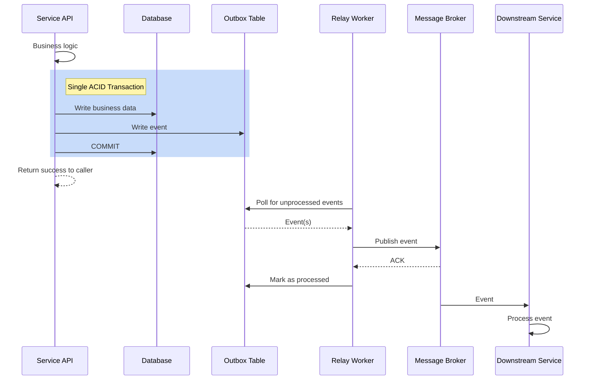

# PLAYBOOK-001: Transactional Outbox Pattern

**Pattern Category**: Data Consistency  
**Complexity**: Medium  
**Maturity**: Proven  
**Last Updated**: 2024-01-25  

---

## 1. Pattern Name

**Transactional Outbox Pattern** (also known as "Application Events Pattern")

---

## 2. Problem

How do you reliably publish events to a message broker (e.g., Kafka, RabbitMQ) after updating a database, ensuring **atomicity** between the database write and the event publish?

### Common Failure Scenarios

❌ **Scenario 1: Publish-First**
```
1. Publish event to Kafka ✓
2. Write to database ✗ (fails)
Result: Event published but state not persisted → inconsistency
```

❌ **Scenario 2: Write-First, Synchronous Publish**
```
1. Write to database ✓
2. Publish event to Kafka ✗ (Kafka down)
Result: State persisted but event never published → downstream services miss update
```

❌ **Scenario 3: Distributed Transaction (2PC)**
```
1. Prepare: Database + Kafka
2. Commit: Both or neither
Result: High latency, complex coordination, single point of failure
```

### Core Challenge

You cannot use distributed transactions across a database and a message broker because:
- Kafka, RabbitMQ, and most brokers don't support two-phase commit (2PC)
- Distributed transactions have high latency and poor scalability
- Introduces tight coupling and single points of failure

---

## 3. Context

### When This Problem Occurs

- **Microservices Architecture**: Services communicate via events/messages
- **Event-Driven Systems**: State changes must trigger downstream actions
- **CQRS**: Command side publishes events to update read models
- **Domain Events**: Aggregate state changes must notify other bounded contexts

### Example Use Cases

✅ Order placed → Notify inventory service  
✅ User registered → Send welcome email  
✅ Payment processed → Update analytics  
✅ Booking cancelled → Send cancellation notification  

### Requirements That Make This Pattern Necessary

- **Atomicity**: Either both database write and event publish succeed, or neither
- **Reliability**: No event loss even during broker downtime
- **Performance**: Low latency for user-facing operations
- **Scalability**: Handle high throughput

---

## 4. Solution

### Pattern Overview

Store events in an **outbox table** within the same database as your primary data. A separate **relay worker** polls the outbox and publishes events to the message broker.



### Key Components

1. **Outbox Table**: Database table that stores events to be published
2. **Transaction**: Single database transaction writes both business data and outbox event
3. **Relay Worker**: Background process that polls outbox and publishes events
4. **Message Broker**: Kafka, RabbitMQ, etc. (downstream event distribution)

---

## 5. Implementation Details

### 5.1 Database Schema

#### Outbox Table Structure

```sql
CREATE TABLE outbox (
  id BIGSERIAL PRIMARY KEY,
  
  -- Event identification
  aggregate_id UUID NOT NULL,           -- ID of the aggregate that changed
  event_type VARCHAR(100) NOT NULL,     -- Type of event (e.g., "OrderPlaced")
  
  -- Event data
  event_payload JSONB NOT NULL,         -- Full event data as JSON
  
  -- Metadata
  created_at TIMESTAMP NOT NULL DEFAULT NOW(),
  processed_at TIMESTAMP NULL,          -- NULL = unprocessed
  
  -- Retry handling
  retry_count INTEGER NOT NULL DEFAULT 0,
  last_error TEXT NULL
);

-- Index for efficient polling (only unprocessed events)
CREATE INDEX idx_outbox_unprocessed 
  ON outbox(created_at) 
  WHERE processed_at IS NULL;

-- Index for cleanup queries (processed events)
CREATE INDEX idx_outbox_processed 
  ON outbox(processed_at) 
  WHERE processed_at IS NOT NULL;
```

#### Example: Booking Cancellation

```sql
-- Business table
CREATE TABLE bookings (
  id UUID PRIMARY KEY,
  user_id UUID NOT NULL,
  status VARCHAR(20) NOT NULL,
  cancelled_at TIMESTAMP NULL,
  -- other fields...
);

-- Outbox table (shared across all events)
CREATE TABLE booking_outbox (
  id BIGSERIAL PRIMARY KEY,
  booking_id UUID NOT NULL,
  event_type VARCHAR(100) NOT NULL,
  event_payload JSONB NOT NULL,
  created_at TIMESTAMP NOT NULL DEFAULT NOW(),
  processed_at TIMESTAMP NULL
);
```

---

### 5.2 Writing Events (Producer Side)

#### Go Implementation

```go
// Service method with transaction
func (s *BookingService) CancelBooking(
  ctx context.Context,
  bookingID uuid.UUID,
  userID uuid.UUID,
  reason string,
) (*Booking, error) {
  
  // Start database transaction
  tx, err := s.db.BeginTx(ctx, nil)
  if err != nil {
    return nil, err
  }
  defer tx.Rollback() // Rollback if not committed
  
  // 1. Load and update business entity
  booking, err := s.repo.FindByID(ctx, tx, bookingID)
  if err != nil {
    return nil, err
  }
  
  booking.Cancel(reason)
  
  if err := s.repo.Update(ctx, tx, booking); err != nil {
    return nil, err
  }
  
  // 2. Write event to outbox (same transaction)
  event := BookingCancelledEvent{
    EventID:     uuid.New(),
    BookingID:   bookingID,
    UserID:      userID,
    CancelledAt: time.Now(),
    Reason:      reason,
  }
  
  if err := s.outbox.Insert(ctx, tx, OutboxEntry{
    AggregateID:  bookingID,
    EventType:    "BookingCancelled",
    EventPayload: event.ToJSON(),
  }); err != nil {
    return nil, err
  }
  
  // 3. Commit transaction (atomic write)
  if err := tx.Commit(); err != nil {
    return nil, err
  }
  
  // Success - event will be published by relay worker
  return booking, nil
}
```

#### Python Implementation

```python
def cancel_booking(
    booking_id: UUID,
    user_id: UUID,
    reason: str,
    db: Session
) -> Booking:
    # Start transaction
    with db.begin():
        # 1. Load and update business entity
        booking = db.query(Booking).filter_by(id=booking_id).first()
        if not booking:
            raise BookingNotFound()
        
        booking.cancel(reason)
        db.add(booking)
        
        # 2. Write event to outbox (same transaction)
        event = BookingCancelledEvent(
            event_id=uuid4(),
            booking_id=booking_id,
            user_id=user_id,
            cancelled_at=datetime.now(),
            reason=reason
        )
        
        outbox_entry = OutboxEntry(
            aggregate_id=booking_id,
            event_type="BookingCancelled",
            event_payload=event.to_json()
        )
        db.add(outbox_entry)
        
        # 3. Commit transaction (atomic write)
        db.commit()
    
    return booking
```

---

### 5.3 Publishing Events (Relay Worker)

#### Polling-Based Relay Worker (Go)

```go
type OutboxRelayWorker struct {
  outbox    OutboxRepository
  broker    MessageBroker
  logger    Logger
  pollRate  time.Duration // e.g., 5 seconds
  batchSize int           // e.g., 100 events
}

func (w *OutboxRelayWorker) Run(ctx context.Context) error {
  ticker := time.NewTicker(w.pollRate)
  defer ticker.Stop()
  
  for {
    select {
    case <-ctx.Done():
      return ctx.Err()
    case <-ticker.C:
      if err := w.processOutbox(ctx); err != nil {
        w.logger.Error("outbox processing failed", err)
      }
    }
  }
}

func (w *OutboxRelayWorker) processOutbox(ctx context.Context) error {
  // Fetch oldest unprocessed events (FIFO order)
  events, err := w.outbox.FetchUnprocessed(ctx, w.batchSize)
  if err != nil {
    return err
  }
  
  if len(events) == 0 {
    return nil // No work to do
  }
  
  for _, event := range events {
    if err := w.publishEvent(ctx, event); err != nil {
      w.logger.Error("failed to publish event",
        "event_id", event.ID,
        "error", err,
      )
      
      // Increment retry count
      w.outbox.IncrementRetry(ctx, event.ID, err.Error())
      
      // Move to dead-letter queue after max retries
      if event.RetryCount >= 5 {
        w.outbox.MoveToDLQ(ctx, event.ID)
      }
      
      continue // Continue processing other events
    }
    
    // Mark as processed (idempotent)
    w.outbox.MarkProcessed(ctx, event.ID)
  }
  
  return nil
}

func (w *OutboxRelayWorker) publishEvent(
  ctx context.Context,
  event OutboxEntry,
) error {
  message := Message{
    Topic: "events",
    Key:   event.AggregateID.String(),
    Value: event.EventPayload,
    Headers: map[string]string{
      "event_type": event.EventType,
      "event_id":   uuid.New().String(),
    },
  }
  
  // Publish with timeout
  publishCtx, cancel := context.WithTimeout(ctx, 10*time.Second)
  defer cancel()
  
  return w.broker.Publish(publishCtx, message)
}
```

#### SQL Query for Fetching Unprocessed Events

```sql
-- Fetch oldest unprocessed events (FIFO order)
SELECT id, aggregate_id, event_type, event_payload, retry_count
FROM outbox
WHERE processed_at IS NULL
ORDER BY created_at ASC
LIMIT 100;
```

---

### 5.4 Alternative: Change Data Capture (CDC)

Instead of polling, use database change streams (CDC) to detect new outbox entries.

#### Using Debezium (Kafka Connect)

```yaml
# Debezium connector configuration
name: outbox-connector
config:
  connector.class: io.debezium.connector.postgresql.PostgresConnector
  database.hostname: postgres
  database.port: 5432
  database.user: user
  database.password: pass
  database.dbname: bookings
  table.include.list: public.outbox
  transforms: outbox
  transforms.outbox.type: io.debezium.transforms.outbox.EventRouter
```

**Pros**:
- Lower latency (near real-time)
- No polling overhead
- Built-in at-least-once delivery

**Cons**:
- Additional infrastructure (Debezium, Kafka Connect)
- More complex setup
- Database-specific (requires WAL for PostgreSQL)

---

## 6. When to Use

### ✅ Use This Pattern When

- **Event-driven architecture**: Services communicate via events
- **Microservices**: Need to publish domain events to other services
- **Reliability required**: Cannot tolerate event loss
- **Database + broker**: Using both transactional DB and message broker
- **Asynchronous processing**: Downstream consumers don't need immediate processing

### ❌ Do NOT Use This Pattern When

- **Synchronous responses needed**: If caller needs immediate downstream result
  - Alternative: Use request/response (HTTP, gRPC)
  
- **No database**: If you're not using a transactional database
  - Alternative: Use broker's built-in transactions (if available)
  
- **Simple pub/sub**: If you don't need transactional guarantees
  - Alternative: Publish directly to broker (accept risk of event loss)
  
- **Low complexity tolerance**: If team can't maintain additional infrastructure
  - Alternative: Accept eventual consistency gaps or use simpler patterns

---

## 7. Trade-offs

### Advantages

✅ **Atomicity**: Guarantees either both database write and event publish succeed, or neither  
✅ **Reliability**: Zero event loss (events persisted in database)  
✅ **Performance**: Fast API response (async event publishing)  
✅ **Resilience**: System continues working even if broker is down  
✅ **Ordering**: Events processed in FIFO order per aggregate  
✅ **Retry logic**: Built-in retry mechanism for failed publishes  

### Disadvantages

⚠️ **Eventual consistency**: Slight delay between database write and event delivery  
⚠️ **Complexity**: Additional infrastructure (outbox table + relay worker)  
⚠️ **Operational overhead**: Need to monitor outbox backlog and DLQ  
⚠️ **Storage growth**: Outbox table grows (requires cleanup job)  
⚠️ **At-least-once delivery**: Events may be published multiple times (consumers must be idempotent)  

---

## 8. Edge Cases and Gotchas

### Edge Case 1: Duplicate Event Publishing

**Problem**: Relay worker crashes after publishing event but before marking as processed.

**Impact**: Event published twice to broker → downstream consumers receive duplicate.

**Solution**: 
- Add unique `event_id` to each event
- Consumers implement **idempotency** (deduplicate by event_id)

```go
// Consumer-side deduplication
func (c *Consumer) HandleEvent(event Event) error {
  // Check if event already processed
  if c.cache.Contains(event.EventID) {
    log.Info("duplicate event detected", "event_id", event.EventID)
    return nil // Skip processing
  }
  
  // Process event
  if err := c.processEvent(event); err != nil {
    return err
  }
  
  // Mark as processed
  c.cache.Set(event.EventID, true, 24*time.Hour)
  return nil
}
```

---

### Edge Case 2: Outbox Table Growth

**Problem**: Outbox table grows indefinitely if processed events aren't deleted.

**Impact**: Slower queries, increased storage costs.

**Solution**: Periodic cleanup job

```sql
-- Delete processed events older than 30 days
DELETE FROM outbox
WHERE processed_at IS NOT NULL
  AND processed_at < NOW() - INTERVAL '30 days';
```

```go
// Cleanup job (cron)
func (j *OutboxCleanupJob) Run(ctx context.Context) error {
  result, err := j.db.ExecContext(ctx, `
    DELETE FROM outbox
    WHERE processed_at IS NOT NULL
      AND processed_at < NOW() - INTERVAL '30 days'
  `)
  if err != nil {
    return err
  }
  
  deleted, _ := result.RowsAffected()
  j.logger.Info("outbox cleanup completed", "rows_deleted", deleted)
  return nil
}
```

---

### Edge Case 3: Poisoned Events (Malformed Data)

**Problem**: Event payload is malformed and fails to publish repeatedly.

**Impact**: Blocks outbox processing, causes backlog.

**Solution**: Dead-letter queue (DLQ)

```go
// Move to DLQ after 5 failed retries
if event.RetryCount >= 5 {
  // Move to separate DLQ table
  if err := w.outbox.MoveToDLQ(ctx, event.ID); err != nil {
    return err
  }
  
  // Alert operations team
  w.alerting.Send("Outbox event moved to DLQ", event)
}
```

```sql
-- Dead-letter queue table
CREATE TABLE outbox_dlq (
  id BIGINT PRIMARY KEY,
  original_event JSONB NOT NULL,
  error_message TEXT NOT NULL,
  moved_at TIMESTAMP NOT NULL DEFAULT NOW()
);
```

---

### Edge Case 4: Relay Worker Crashes

**Problem**: Relay worker process crashes or is killed.

**Impact**: Events not published until worker restarts.

**Solution**: Deploy multiple worker instances (redundancy)

```yaml
# Kubernetes deployment with 3 replicas
apiVersion: apps/v1
kind: Deployment
metadata:
  name: outbox-relay-worker
spec:
  replicas: 3  # Multiple workers for redundancy
  template:
    spec:
      containers:
      - name: worker
        image: outbox-relay:v1.0
```

**Note**: Multiple workers are safe because:
- Each worker fetches different batch of events
- `processed_at` prevents duplicate processing
- Database-level locks prevent race conditions

---

### Edge Case 5: Broker Unavailability

**Problem**: Kafka/RabbitMQ is down for extended period.

**Impact**: Outbox backlog grows.

**Solution**: 
- **Monitoring**: Alert when outbox size > threshold
- **Auto-scaling**: Scale up worker replicas to handle backlog
- **Graceful degradation**: API continues working (events queued)

```yaml
# Prometheus alert
- alert: OutboxBacklogHigh
  expr: outbox_unprocessed_count > 10000
  for: 10m
  annotations:
    summary: "Outbox backlog > 10k events - check broker health"
```

---

## 9. Checklist for Implementation

### Before Writing Code

- [ ] Identify aggregates that publish events
- [ ] Define event schemas (payload structure)
- [ ] Choose event serialization format (JSON, Protobuf, Avro)
- [ ] Design outbox table schema
- [ ] Plan cleanup strategy for processed events

### During Implementation

- [ ] Create outbox table with indexes
- [ ] Update service layer to write to outbox in transactions
- [ ] Implement relay worker with retry logic
- [ ] Add dead-letter queue for poisoned events
- [ ] Implement idempotency in consumers (deduplicate by event_id)
- [ ] Add unique event_id to each event

### After Implementation

- [ ] Add monitoring metrics (outbox size, processing lag)
- [ ] Set up alerts (backlog, DLQ growth)
- [ ] Test failure scenarios (broker down, worker crash)
- [ ] Load test with high throughput
- [ ] Document operational runbooks

### Production Readiness

- [ ] Deploy multiple relay worker instances (redundancy)
- [ ] Configure auto-scaling for workers
- [ ] Set up outbox cleanup job (cron)
- [ ] Verify at-least-once delivery guarantees
- [ ] Test rollback procedure

---

## 10. Monitoring and Observability

### Key Metrics

```yaml
# Prometheus metrics
outbox_unprocessed_count - Gauge (current backlog)
outbox_processing_lag_seconds - Gauge (age of oldest unprocessed event)
outbox_events_published_total{status="success|error"} - Counter
outbox_retry_count - Histogram (distribution of retry counts)
outbox_dlq_size - Gauge (dead-letter queue size)
```

### Recommended Alerts

```yaml
# High backlog
- alert: OutboxBacklogHigh
  expr: outbox_unprocessed_count > 10000
  for: 10m

# Processing lag
- alert: OutboxProcessingLag
  expr: outbox_processing_lag_seconds > 60
  for: 5m

# DLQ growth
- alert: OutboxDLQGrowing
  expr: increase(outbox_dlq_size[1h]) > 100
```

### Observability Best Practices

- **Correlation IDs**: Include request_id in logs for tracing
- **Distributed tracing**: Trace event flow (API → Outbox → Broker → Consumer)
- **Dashboard**: Grafana dashboard showing outbox health metrics

---

## 11. Example References

### Real-World Implementations

- **ADR-023**: Booking Cancellation (this codebase)
  - See `/docs/examples/example-adr.md`
  - Cancels booking and publishes `BookingCancelled` event
  
- **Order Service**: Order placement
  - Writes order to `orders` table
  - Writes `OrderPlaced` event to outbox
  - Triggers inventory reservation and payment processing

- **User Service**: User registration
  - Writes user to `users` table
  - Writes `UserRegistered` event to outbox
  - Triggers welcome email and analytics tracking

---

## 12. Alternatives Considered

### Alternative 1: Direct Broker Publish (No Outbox)

**Approach**: Publish to broker immediately after database write

```go
// ❌ NOT RECOMMENDED
tx.Commit()
kafka.Publish(event) // If this fails, data is lost
```

**Why Rejected**: No atomicity guarantee - event can be lost if broker is down

---

### Alternative 2: Two-Phase Commit (2PC)

**Approach**: Distributed transaction across database and broker

**Why Rejected**: 
- Most brokers don't support 2PC
- High latency and complexity
- Single point of failure

---

### Alternative 3: Saga Pattern

**Approach**: Compensating transactions for rollback

**Why Rejected**: Overkill for simple event publishing (Saga better for multi-step workflows)

---

## 13. Further Reading

### Academic Papers
- ["Making Reliable Distributed Systems in the Presence of Software Errors"](http://erlang.org/download/armstrong_thesis_2003.pdf) - Joe Armstrong (Erlang)

### Articles
- [Transactional Outbox Pattern](https://microservices.io/patterns/data/transactional-outbox.html) - Chris Richardson
- [The Outbox Pattern](https://debezium.io/blog/2019/02/19/reliable-microservices-data-exchange-with-the-outbox-pattern/) - Debezium Blog
- [Achieving Exactly-Once Delivery](https://www.confluent.io/blog/exactly-once-semantics-are-possible-heres-how-apache-kafka-does-it/) - Confluent

### Tools
- [Debezium](https://debezium.io/) - CDC-based outbox pattern
- [Kafka Connect](https://docs.confluent.io/platform/current/connect/index.html) - Connector framework
- [Outbox Pattern Library (Java)](https://github.com/openwms/org.openwms.common.comm.osip) - Reference implementation

---

## 14. Version History

| Version | Date       | Changes                          | Author       |
|---------|------------|----------------------------------|--------------|
| 1.0     | 2024-01-25 | Initial playbook entry           | Jane Smith   |

---

**Pattern Status**: Proven in Production  
**Recommended**: Yes  
**Review Date**: 2025-01-25  
