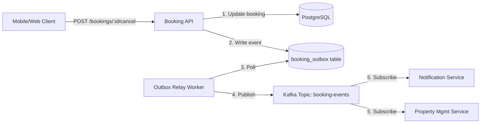

# RFC-023: Booking Cancellation Implementation

**RFC Number**: RFC-023  
**Author**: Jane Smith (Senior Engineer)  
**Contributors**: Engineering Team  
**Status**: Under Review  
**Created**: 2024-01-22  
**Updated**: 2024-01-23  
**Related PRD**: PRD-015  
**Related DAA**: AI-DAA Booking Cancellation  

---

## 1. Summary

This RFC proposes the technical implementation for the booking cancellation feature defined in PRD-015. Users will be able to cancel their confirmed bookings through a REST API, with reliable event publishing to downstream services.

---

## 2. Context

### Business Need
- Currently, 60% of support tickets are cancellation requests
- Users have no self-service option to cancel bookings
- Manual cancellations are slow and error-prone

### Technical Context
- Existing `booking-service` written in Go
- PostgreSQL database for booking state
- Kafka for event streaming
- Microservices architecture with Notification and Property Management services as downstream consumers

### Success Criteria (from PRD)
- 80% self-service cancellations
- p95 API latency < 500ms
- 99.9% uptime
- Zero event loss

---

## 3. Proposed Solution

### High-Level Architecture



### Key Design Decisions

#### Decision 1: Transactional Outbox Pattern
Use the outbox pattern to guarantee event delivery without distributed transactions.

**Why**: Ensures atomicity between database write and event publish. If notification service is down, cancellation still succeeds and events are delivered later.

**Trade-off**: Additional complexity (outbox table + relay worker) vs. reliability guarantee.

#### Decision 2: Synchronous API Response
Return success immediately after database commit, before event publishing.

**Why**: Meets p95 latency requirement of 500ms. Event publishing can be async.

**Trade-off**: User might see success before notification is sent.

#### Decision 3: Database-Level Constraints
Enforce business rules via database constraints where possible.

**Why**: Prevents race conditions even under high concurrency.

**Trade-off**: Some business logic in database layer.

---

## 4. Implementation Details

### API Contract

```
POST /v1/bookings/{booking_id}/cancel

Request:
{
  "reason": "change_of_plans",  // Required enum
  "notes": "Optional free text"  // Optional string
}

Response 200 OK:
{
  "booking_id": "uuid",
  "status": "cancelled",
  "cancelled_at": "2024-01-22T14:30:00Z",
  "cancellation_reason": "change_of_plans",
  "cancellation_notes": "Optional free text"
}

Errors:
- 400: Invalid reason or booking cannot be cancelled
- 403: User does not own booking
- 404: Booking not found
- 500: Internal server error
```

### Database Schema Changes

```sql
-- Add cancellation fields
ALTER TABLE bookings 
  ADD COLUMN cancelled_at TIMESTAMP,
  ADD COLUMN cancellation_reason VARCHAR(50),
  ADD COLUMN cancellation_notes TEXT;

-- Enforce enum constraint
ALTER TABLE bookings
  ADD CONSTRAINT check_cancellation_reason 
  CHECK (cancellation_reason IN (
    'change_of_plans', 'double_booking', 
    'found_alternative', 'no_longer_needed', 'other'
  ));

-- Enforce consistency: if cancelled, reason must exist
ALTER TABLE bookings
  ADD CONSTRAINT check_cancellation_consistency
  CHECK (
    (status = 'cancelled' AND cancellation_reason IS NOT NULL) OR
    (status != 'cancelled' AND cancellation_reason IS NULL)
  );

-- Outbox table for reliable event publishing
CREATE TABLE booking_outbox (
  id BIGSERIAL PRIMARY KEY,
  booking_id UUID NOT NULL,
  event_type VARCHAR(100) NOT NULL,
  event_payload JSONB NOT NULL,
  created_at TIMESTAMP NOT NULL DEFAULT NOW(),
  processed_at TIMESTAMP
);

CREATE INDEX idx_outbox_unprocessed ON booking_outbox(created_at) 
  WHERE processed_at IS NULL;
```

### Service Flow

1. **Authentication**: Verify user JWT token
2. **Authorization**: Verify user owns the booking
3. **Validation**: Check booking status = 'confirmed'
4. **Transaction Begin**
   - Update booking status to 'cancelled'
   - Set cancelled_at, cancellation_reason, cancellation_notes
   - Insert BookingCancelled event into outbox table
5. **Transaction Commit**
6. **Return 200 OK** to client

### Outbox Relay Worker

- Polls `booking_outbox` every 5 seconds for unprocessed events
- Publishes events to Kafka topic `booking-events`
- Marks events as processed after successful publish
- Implements retry logic with exponential backoff
- Dead-letter queue for poison pills after 5 retry attempts

---

## 5. Applicable Playbook Patterns

### PLAYBOOK-001: Transactional Outbox Pattern
**Applied**: Yes - for reliable event publishing  
**Reference**: See `example-playbook-entry.md`

### PLAYBOOK-004: Idempotent API Design
**Applied**: Partially - need to discuss idempotency key approach  
**Question**: Should duplicate cancel requests return 200 or 409?

### PLAYBOOK-007: Database Constraint-Based Validation
**Applied**: Yes - using CHECK constraints for business rules

---

## 6. Open Questions

### Q1: Idempotency Strategy
**Question**: How should we handle duplicate cancellation requests (e.g., user clicks twice)?

**Options**:
1. Return 400 "Already Cancelled" error
2. Return 200 with existing cancellation data (idempotent)
3. Use idempotency key in request header

**Recommendation**: Option 2 (idempotent) - simplest for clients

**Decision Needed By**: Design review session

---

### Q2: Outbox Worker Failure Handling
**Question**: What happens if outbox worker crashes for extended period?

**Options**:
1. Manual intervention to replay events
2. Alert on outbox table size > threshold
3. Multiple worker instances for redundancy

**Recommendation**: Option 2 + 3 (alerting + redundancy)

**Decision Needed By**: Design review session

---

### Q3: Cancellation Rate Limiting
**Question**: Should we rate-limit cancellations per user to prevent abuse?

**Initial Thought**: Not needed for MVP. Monitor in production first.

**Decision Needed By**: Product review

---

## 7. Security Considerations

- ✅ Authorization: Verify user owns booking before cancellation
- ✅ Input validation: Enum validation for cancellation reason
- ✅ SQL injection: Using parameterized queries
- ✅ Audit logging: All cancellations logged with user_id and timestamp
- ❓ Rate limiting: See Q3 above

---

## 8. Monitoring & Observability

### Metrics
```
booking_cancellation_requests_total{status="success|error"}
booking_cancellation_duration_seconds (histogram)
booking_outbox_size (gauge)
booking_outbox_processing_lag_seconds (gauge)
```

### Alerts
```
- CancellationAPIErrorRate > 5% for 5 minutes
- CancellationAPILatencyP95 > 500ms for 5 minutes
- OutboxSize > 10000 events (backlog alert)
- OutboxLag > 60 seconds (processing delay)
```

### Logging
- INFO: Every cancellation with booking_id, user_id, reason
- ERROR: All failures with stack traces
- Structured JSON logs for easy querying

---

## 9. Testing Strategy

### Unit Tests
- Service layer: cancel logic with mocked repository
- Validation: all error cases (invalid status, wrong user, etc.)
- Outbox worker: event publishing logic

### Integration Tests
- End-to-end: API → Database → Outbox → Kafka
- Concurrent cancellations (race condition test)
- Database constraint enforcement

### Load Tests
- 1000 concurrent cancellation requests
- Verify p95 < 500ms under load
- Verify no event loss under stress

---

## 10. Rollout Plan

### Phase 1: Internal Testing (Week 1)
- Deploy to staging with feature flag OFF
- Run integration tests and load tests
- Manual QA testing

### Phase 2: Soft Launch (Week 2)
- Enable feature flag for 10% of users
- Monitor metrics and error rates
- Gather user feedback

### Phase 3: Full Rollout (Week 3)
- Enable for 50% of users (if Phase 2 successful)
- Full rollout to 100% after 24 hours
- Monitor cancellation rate and support ticket reduction

### Rollback Plan
- Feature flag can disable feature instantly
- Database migration is backwards compatible
- No data migration needed for rollback

---

## 11. Timeline & Effort

| Task | Estimate | Owner |
|------|----------|-------|
| Database migration | 2 hours | Jane |
| Service layer implementation | 8 hours | Jane |
| Outbox relay worker | 6 hours | Mike |
| API endpoint + validation | 4 hours | Jane |
| Unit tests | 6 hours | Team |
| Integration tests | 4 hours | Team |
| Load testing | 3 hours | SRE |
| Documentation | 2 hours | Jane |
| **Total** | **35 hours (~1 week)** | |

---

## 12. Risks & Mitigation

| Risk | Impact | Probability | Mitigation |
|------|--------|-------------|------------|
| Race condition on concurrent cancels | High | Medium | Database constraint + optimistic locking |
| Outbox worker failure | High | Low | Multiple workers + alerting |
| Kafka unavailability | Medium | Low | Outbox buffers events, no data loss |
| High cancellation volume | Medium | Medium | Auto-scaling + rate limiting if needed |

---

## 13. Alternative Approaches Considered

### Alternative 1: Synchronous Event Publishing
**Description**: Publish to Kafka directly in API handler

**Pros**: Simpler implementation, no outbox table needed

**Cons**: 
- Violates atomicity - booking cancelled but event lost if Kafka down
- Increases API latency
- Doesn't meet reliability NFR

**Decision**: Rejected

---

### Alternative 2: Saga Pattern
**Description**: Use distributed transaction/saga for cancellation

**Pros**: Stronger consistency guarantees

**Cons**:
- Massive overkill for this use case
- Increased complexity
- Cancellation is one-way operation, saga not needed

**Decision**: Rejected

---

## 14. Next Steps

1. ✅ Draft RFC (this document)
2. ⏳ Team review and discussion
3. ⏳ AI collaborative design session (consult Playbook)
4. ⏳ Finalize design and create ADR
5. ⏳ Implementation (Bolts)
6. ⏳ Testing
7. ⏳ Deployment

---

## 15. Feedback & Discussion

### Comment Thread

**Mike (DevOps)** - Jan 23, 10:00 AM:
> For Q2, I recommend deploying 3 outbox worker instances behind a load balancer. We should also add a Prometheus alert if outbox size > 10k.

**Sarah (Architect)** - Jan 23, 11:30 AM:
> Agree with outbox pattern choice. Have you considered optimistic locking for the booking update? CAS (Compare-and-Swap) on a version column?

**Jane (Author)** - Jan 23, 2:00 PM:
> @Sarah Good point. I'll add a `version` column to bookings table and implement optimistic locking in the service layer. Will update RFC.

---

**Status**: Awaiting final review before ADR generation  
**Next Review**: 2024-01-24 Design Session
