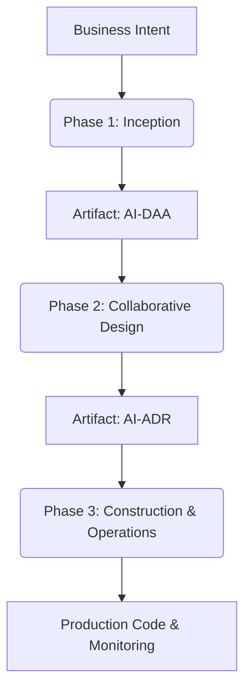
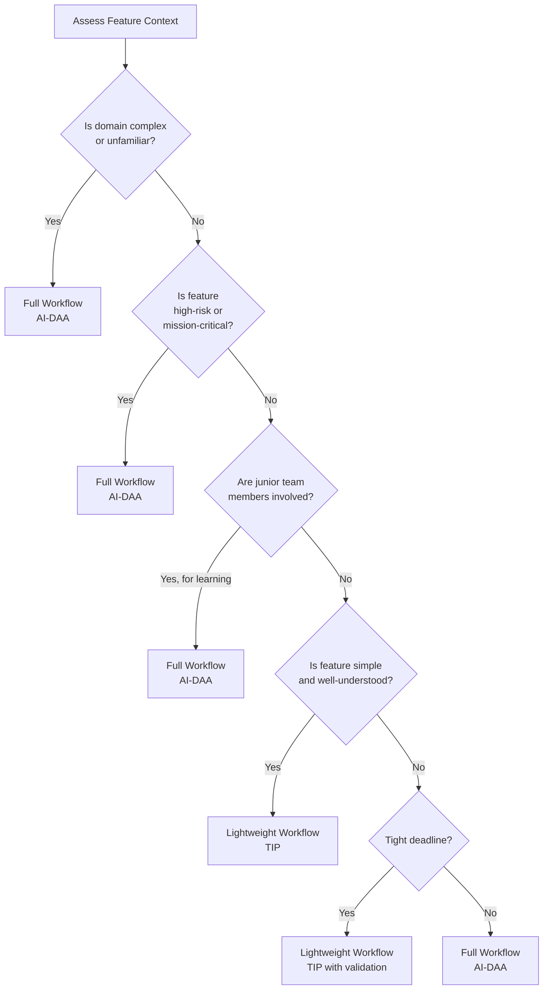
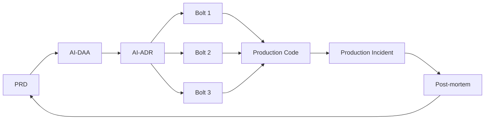

# AirSDLC Lifecycle

## Overview

The AirSDLC lifecycle is built on a **sequential knowledge handoff** model. Each phase transforms and enriches the context from the previous phase, creating an unbroken chain of traceability from business intent to production code.



## Phase 1: Inception (The "WHAT")

### Objective
Translate an ambiguous business goal into a pure, technology-agnostic, and validated model of the business domain.

### Input
- **Business Intent**: A high-level description of what needs to be built (e.g., "We need a room booking system")
- **Product Requirements Document (PRD)**: Structured requirements including user stories, acceptance criteria, and success metrics

### Process

#### Step 1: Choose the Workflow Path
The lead engineer or architect assesses the feature's context to determine the appropriate level of upfront modeling:

**Decision Matrix:**



#### Step 2A: Full Workflow - Generate AI-DAA
For complex or high-risk features, the AI generates a **Domain Architecture Analysis (AI-DAA)**:

1. **Parse the PRD**: AI identifies key "nouns" (entities) and "verbs" (operations)
2. **Apply Strategic DDD**: AI proposes Bounded Contexts and Context Maps
3. **Apply Tactical DDD**: AI defines Aggregates, Entities, Value Objects, and Domain Events
4. **Generate Pseudocode**: AI writes technology-agnostic pseudocode for all operations
5. **Validate Invariants**: AI explicitly documents business rules and constraints

**Key Characteristics of a Well-Formed DAA:**
- ✅ 100% technology-neutral (no databases, frameworks, or languages mentioned)
- ✅ Uses DDD patterns consistently
- ✅ All business invariants are explicit
- ✅ Every user story from the PRD maps to at least one operation
- ✅ Written in clear pseudocode understandable by non-technical domain experts

#### Step 2B: Lightweight Workflow - Write TIP
For simple, well-understood features, the engineer creates a **Technical Implementation Proposal (TIP)**:

1. **Read the PRD**: Engineer understands requirements
2. **Draft Technical Details**: Engineer proposes:
   - Database schema changes
   - API endpoints
   - Service modifications
   - Integration points
3. **Identify Questions**: Engineer flags unknowns or concerns

**Key Difference from DAA:**
- ✅ Technology-specific (mentions actual databases, APIs, etc.)
- ✅ More direct and concrete
- ✅ Skips abstract domain modeling
- ✅ Faster to create for simple features

### Human Validation Gate

Regardless of workflow path, the output must pass human validation:

**For AI-DAA:**
- Does it accurately model the business domain?
- Are all PRD requirements addressed?
- Are the proposed Bounded Contexts sensible?
- Do the invariants reflect real business rules?
- Can a domain expert understand the pseudocode?

**For TIP:**
- Does it address all PRD requirements?
- Are the technical choices appropriate?
- Are integration points clearly defined?
- Are edge cases considered?

**Validation Technique**: Use AI to generate a "Coverage Report" that compares the DAA/TIP against the PRD, highlighting any gaps.

### Output
- **Full Workflow**: **Validated AI-DAA** - The locked domain model
- **Lightweight Workflow**: **Draft TIP** - The engineer's initial technical proposal

### When to Use Full vs. Lightweight

**Use Full Workflow when:**
- The domain is unfamiliar to the team
- The feature has high business complexity
- The feature is mission-critical or high-risk
- You want to teach junior engineers structured thinking
- The feature will likely evolve significantly

**Use Lightweight Workflow when:**
- The feature is a simple CRUD operation
- The domain is well-understood by the team
- The technical implementation is obvious
- Timeline pressure requires speed
- The team is experienced with the technology

**Non-Negotiable**: Even in the Lightweight Workflow, validation is mandatory.

---

## Phase 2: Collaborative Design (The "HOW")

### Objective
Synthesize the "what" from the Inception phase with the "how" of a technical implementation, resulting in a robust architectural decision.

### Input
- **From Phase 1**: Validated AI-DAA (Full Workflow) or Draft TIP (Lightweight Workflow)
- **Engineer's RFC**: A draft Request for Comments containing:
  - The DAA or TIP
  - Initial technical thoughts
  - Open questions
  - Constraints (budget, timeline, team skills)

### Process

#### Step 1: Prepare the RFC
The engineer formalizes the output from Inception into an RFC document:

**RFC Structure:**
- **Title & Metadata**: Feature name, author, date, status
- **Context**: Link to PRD, business justification
- **Problem Statement**: From the DAA (if Full Workflow) or PRD summary (if Lightweight)
- **Proposed Implementation**: Initial technical approach
- **Open Questions**: What needs discussion?
- **Constraints**: Non-negotiables (timeline, budget, compliance, etc.)

#### Step 2: Consult the Architectural Playbook
Before the collaborative session, the architect identifies applicable patterns from the **Architectural Playbook**:

**Example Playbook Patterns:**
- Transactional Outbox Pattern (for reliable event publishing)
- Idempotent API Design (for at-least-once delivery guarantees)
- Circuit Breaker Pattern (for resilient service calls)
- CQRS Pattern (for read-heavy workloads)
- Saga Pattern (for distributed transactions)

The Playbook provides:
- **Problem description**: When to use this pattern
- **Solution details**: How to implement it
- **Trade-offs**: Pros and cons
- **Edge case checklist**: What to watch for

#### Step 3: The Collaborative Discussion - AI as Socratic Sparring Partner
This is the heart of Phase 2. The architect engages in an active dialogue with the AI:

**The Process:**
1. **Provide Context**: Feed the AI the RFC, DAA/TIP, and relevant Playbook patterns
2. **Prompt for Challenge**: "Review this design. Challenge it. What could go wrong?"
3. **Explore Alternatives**: "Propose 3 alternative approaches and compare trade-offs."
4. **Deep Dive on Risks**: "How should we handle [specific edge case]?"
5. **Generate Diagrams**: "Create a sequence diagram showing the event flow."
6. **Iterate**: Refine the design based on AI's feedback and architect's judgment

**Key Technique**: Use **diagrams-as-code** (Mermaid, PlantUML) to clarify thinking. Visual representations often surface hidden assumptions.

**Example Dialogue:**
```
Architect: "I'm proposing to use synchronous HTTP calls for booking confirmations."

AI: "This creates tight coupling and a potential single point of failure. If the 
notification service is down, the booking creation will fail. Have you considered 
an asynchronous, event-driven approach using the Transactional Outbox Pattern 
from your Playbook?"

Architect: "Good point. But won't that add latency to confirmations?"

AI: "Yes, there will be a slight delay (typically seconds). However, the trade-off 
is increased reliability and decoupling. Given your NFR states '99.9% uptime for 
booking creation,' this trade-off is favorable. The confirmation latency is acceptable 
for this use case based on your PRD."

Architect: "Agreed. Generate a sequence diagram showing the outbox pattern flow."

AI: [Generates Mermaid diagram]

Architect: "Perfect. How do we handle poison pills in the outbox relay?"

AI: "You should implement a dead-letter queue pattern. After 3 retry attempts, 
messages should be moved to a DLQ for manual investigation. This is covered in 
Playbook entry 'DLQ-001.'"
```

#### Step 4: Finalize the Design
Once the architect is satisfied that the design is robust and all major risks are addressed:

1. The RFC is updated with final decisions
2. Open questions are resolved
3. Trade-offs are explicitly documented

### Human Validation Gate

The architect (or senior engineer) must validate:
- ✅ Does the design respect the domain invariants from the DAA?
- ✅ Are all trade-offs explicitly documented?
- ✅ Have applicable Playbook patterns been considered?
- ✅ Are edge cases addressed?
- ✅ Is the design implementable given constraints (team skills, timeline)?
- ✅ Have alternatives been considered and rejected with clear rationale?

### Output
**AI-ADR (Architectural Decision Record)**: The finalized, immutable specification for implementation.

The ADR contains:
- **Decision**: The chosen technical approach
- **Rationale**: Why this approach (referencing the DAA and trade-off analysis)
- **Implementation Details**: High-level technical specification
- **Diagrams**: Sequence diagrams, architecture diagrams (as code)
- **Rejected Alternatives**: What was considered and why it was rejected
- **Edge Cases**: How specific scenarios will be handled

---

## Phase 3: Construction & Operations (The "BUILD & RUN")

### Objective
Use the finalized AI-ADR to generate, test, and deploy production-ready code, then provide context-aware monitoring and incident response.

### Part A: Construction

#### Input
- **Finalized AI-ADR** from Phase 2

#### Process

**Step 1: Break into Bolts**
The project is decomposed into discrete, focused implementation units called **Bolts**:

**Characteristics of a Good Bolt:**
- ✅ Single goal (e.g., "Implement the POST /bookings endpoint")
- ✅ Completable in hours or days (not weeks)
- ✅ Has clear acceptance criteria from the ADR
- ✅ Produces a testable artifact

**Example Bolt Breakdown for "Room Booking System":**
- Bolt 1: Create database migration for `bookings` and `rooms` tables
- Bolt 2: Implement `POST /bookings` API handler
- Bolt 3: Implement `BookingAggregate` business logic with conflict detection
- Bolt 4: Implement Transactional Outbox relay worker for booking events
- Bolt 5: Add monitoring dashboards for booking success/conflict metrics

**Step 2: Implement Each Bolt**
For each Bolt, the engineer leverages AI for boilerplate generation:

1. **Prompt AI**: "Based on ADR-003, generate the Go boilerplate for the POST /bookings handler."
2. **AI Generates**: Route definition, handler function, input validation, error handling
3. **Engineer Implements**: Core business logic (conflict detection, availability checks), complex algorithms, domain-specific rules
4. **AI Generates Tests**: Unit tests, integration tests based on the ADR's acceptance criteria
5. **Engineer Reviews**: Validate tests are comprehensive

**Division of Labor:**
- **AI**: Boilerplate, CRUD operations, standard patterns, test scaffolding
- **Human**: Business logic, complex algorithms, performance optimization, security reviews

**Step 3: Validate Against ADR**
After implementation, use AI to generate a "Compliance Report":
- Does the code match the design in the ADR?
- Are all edge cases from the ADR handled?
- Do tests cover the scenarios described in the ADR?

#### Output
- **Production-Ready Code**: Fully tested, reviewed code
- **Tests**: Unit, integration, and end-to-end tests
- **Deployment Artifacts**: IaC configurations, container images, deployment scripts

### Part B: Operations

#### Objective
Deploy and monitor the system using the full traceability chain for context-aware incident response.

#### Deployment
1. Code is deployed through standard CI/CD pipelines
2. Monitoring is configured based on the success metrics from the PRD and NFRs

#### Context-Aware Monitoring
The AI has access to the full Knowledge Repository:
- PRD (what success looks like)
- DAA (domain model and invariants)
- ADR (technical implementation details)
- Code (actual implementation)
- Bolt history (what was built when)

When an alert fires, the AI can:
- Correlate metrics to specific features and design decisions
- Identify which Bolt introduced a change
- Trace requirements back to the original PRD

#### Incident Response Process
See [Operations](operations.md) for the complete incident handling workflow.

**High-Level Flow:**
1. **Alert Triggered**: Production error or metric breach
2. **Human Gathers Context**: On-call engineer collects logs, stack traces
3. **AI Correlation**: AI traces error to Bolt → ADR → DAA → PRD
4. **AI Proposes Fix**: Based on design intent, AI suggests a Fix-It Bolt
5. **Human Validates**: Engineer reviews and approves
6. **AI Generates Hotfix PR**: Code change + updated tests + ADR amendment
7. **Human Deploys**: Standard CI/CD process

---

## The Knowledge Repository: The Connecting Thread

Throughout all three phases, every artifact is stored in a centralized **Knowledge Repository**:



This repository enables:
- **Traceability**: Follow any feature from business goal to deployed code
- **Impact Analysis**: "Which PRD features are affected by this service outage?"
- **Complexity Metrics**: "How many Aggregates does this feature touch?"
- **Knowledge Capture**: Design decisions are never lost

---

## Lifecycle Summary

| Phase | Input | Process | Output | Duration |
|-------|-------|---------|--------|----------|
| **Inception** | PRD | AI generates DAA or Engineer writes TIP | Validated DAA or Draft TIP | Hours to 1 day |
| **Design** | DAA/TIP + RFC | Human-AI collaborative design | Finalized AI-ADR | Hours to 2 days |
| **Construction** | AI-ADR | Break into Bolts, AI generates boilerplate | Production code | Days to weeks |
| **Operations** | Deployed code + Repository | Monitor, correlate, respond | Stable production + Post-mortems | Ongoing |

---

**Next**: [Artifacts](artifacts.md) - Detailed specifications for each artifact type
