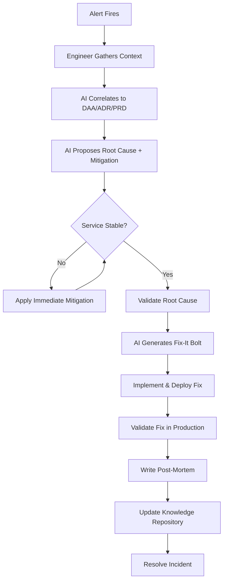

# AirSDLC Operations

## Overview

The AirSDLC framework extends beyond deployment into production operations. The same principles of AI-augmentation and end-to-end traceability that accelerate development also transform incident management from a reactive scramble into a structured, context-aware investigation.

This document describes how to leverage the full Knowledge Repository for faster, more effective operational response.

## Core Principle: Context-Aware Operations

Traditional incident response:
```
Alert → Engineer wakes up → Reads logs → Searches code → Guesses root cause
→ Trial-and-error fixes → Eventually resolves (hours/days)
```

AirSDLC incident response:
```
Alert → Engineer gathers context → AI correlates to DAA/ADR/PRD → AI proposes fix
→ Human validates → AI generates Fix-It Bolt → Deploy (minutes/hours)
```

**Key Difference**: The AI has access to the entire design context, not just the code.

---

## The Incident Response Workflow

### Phase 1: Detection and Triage

#### Step 1: Alert Fires

**Trigger**: Monitoring system detects anomaly
- Metric breach (error rate > threshold)
- Performance degradation (latency spike)
- Availability issue (service down)
- Business metric failure (transaction success rate drop)

**Example Alert**:
```
ALERT: Booking Cancel API Error Rate > 5%
Severity: SEV-2
Time: 2024-01-15 10:00 UTC
Affected: POST /v1/bookings/{id}/cancel
Error Count: 150 errors in last 5 minutes
Primary Error: "database connection timeout"
```

---

#### Step 2: Human Gathers Initial Context

**Participant**: On-call Engineer (Incident Commander)

**Actions**:
1. **Acknowledge the alert** (stop paging)
2. **Assess severity**:
   - SEV-1: Total outage, data loss, security breach
   - SEV-2: Partial outage, degraded service
   - SEV-3: Non-critical issue, workaround available
3. **Gather artifacts**:
   - Error logs from affected service (last 15 minutes)
   - Stack trace of representative error
   - Affected API endpoint / service name
   - Recent deployments (was anything changed recently?)
4. **Declare incident** (notify team via Slack/PagerDuty)

**Output**: Incident ticket with initial context

**Time**: 5 minutes

**Example Context Package**:
```markdown
## Incident INC-2024-001

**Severity**: SEV-2
**Start Time**: 2024-01-15 10:00 UTC
**Service**: booking-service
**Endpoint**: POST /v1/bookings/{id}/cancel
**Error**: Database connection timeout

**Stack Trace**:
```
panic: pq: connection timeout
  at booking_service.go:152 in CancelBooking()
  at api_handler.go:89 in HandleCancel()
```

**Recent Changes**:
- Deploy: booking-service v1.4.2 (2 hours ago)
- Related Bolt: BOLT-045 (Outbox relay worker)
```

---

#### Step 3: AI Correlation and Root Cause Hypothesis

**Participant**: Engineer + AI

**Input**: Context package from Step 2

**Process**:

Prompt AI:
```
You are an SRE assisting with incident response. I have a production error.
Your task is to:
1. Correlate this error to our Knowledge Repository (Bolt, ADR, DAA, PRD)
2. Propose a root cause hypothesis
3. Suggest immediate mitigation steps

Use the full traceability chain.

Incident Context:
[Paste incident details from Step 2]

Knowledge Repository Access:
- Stack trace shows booking_service.go:152
- Service: booking-service
- Endpoint: POST /v1/bookings/{id}/cancel

Please analyze.
```

**AI Response** (example):
```
## Correlation Analysis

**Code Location**: booking_service.go:152
- **Bolt**: BOLT-044 (Implement Booking Cancel API)
- **ADR**: ADR-023 (Booking Cancel with Transactional Outbox)
- **DAA**: Section 3.2 (Booking Aggregate cancel operation)
- **PRD**: PRD-015, User Story 2 (Cancel booking)

## Root Cause Hypothesis

Based on ADR-023, the cancel operation writes to two tables atomically:
1. Update `bookings` table (status = cancelled)
2. Insert into `booking_outbox` table (BookingCancelled event)

The error "database connection timeout" suggests connection pool exhaustion.

**Contributing Factors**:
- Recent deploy: BOLT-045 introduced the outbox relay worker
- ADR-023 does NOT specify connection pool size or transaction timeout
- If the relay worker holds connections too long, API requests starve

**Evidence to Gather**:
- Current database connection count
- Outbox table size (is relay keeping up?)
- Average transaction duration for cancel operations

## Immediate Mitigation

**Option 1** (Low Risk): Increase database connection pool size
- Pros: Quick, no code change
- Cons: Doesn't fix root cause if worker is leaking connections

**Option 2** (Medium Risk): Restart outbox relay worker
- Pros: Releases any held connections
- Cons: Temporary event publish delay (5-60 seconds)

**Recommended**: Option 2 (restart worker), then investigate connection leak.
```

**Output**: AI-generated triage report with hypotheses

**Time**: 5-10 minutes

---

### Phase 2: Mitigation and Stabilization

#### Step 4: Apply Immediate Mitigation

**Participant**: Engineer

**Process**:
1. Review AI's mitigation suggestions
2. Choose lowest-risk option for immediate relief
3. Execute mitigation
4. Monitor for impact

**Example**:
```bash
# Restart outbox relay worker
kubectl rollout restart deployment/outbox-relay-worker -n production

# Monitor error rate
watch -n 5 'curl -s https://metrics.example.com/booking-cancel-errors'
```

**Output**: Service stabilized (error rate returns to normal)

**Time**: 5-15 minutes

---

#### Step 5: Validate Hypothesis (Root Cause Analysis)

**Participant**: Engineer + AI

**Process**:

Once immediate crisis is over, dig deeper:

1. **Gather evidence**
   ```bash
   # Check database connection usage
   psql -h prod-db -c "SELECT count(*) FROM pg_stat_activity;"
   
   # Check outbox table size
   psql -h prod-db -c "SELECT count(*) FROM booking_outbox WHERE processed_at IS NULL;"
   ```

2. **Share findings with AI**
   Prompt:
   ```
   I've mitigated the incident by restarting the worker. Here's what I found:
   - Database had 95/100 connections in use (before restart)
   - Outbox table had 8,500 unprocessed events
   - After restart, connections dropped to 15/100
   
   This confirms your hypothesis about connection exhaustion. What was the 
   root cause in the worker implementation?
   
   Worker Code:
   [Paste BOLT-045 implementation or link to file]
   ```

3. **AI identifies bug**
   ```
   Root Cause Found:
   
   In outbox_worker.go:78, the worker queries events in batches of 1000,
   but opens a new database transaction for EACH event rather than batching
   them. This means:
   - 1000 events = 1000 concurrent connections
   - With slow Kafka, each transaction stays open for 5-10 seconds
   - Connection pool (size 100) is quickly exhausted
   
   Fix: Batch events in a single transaction or reduce batch size to 10-20.
   
   ADR-023 should be amended to specify:
   - Maximum batch size for outbox relay
   - Transaction timeout requirements
   - Connection pool sizing guidelines
   ```

**Output**: Confirmed root cause with specific code location

**Time**: 15-30 minutes

---

### Phase 3: Permanent Fix

#### Step 6: Generate Fix-It Bolt

**Participant**: Engineer + AI

**Process**:

Prompt AI:
```
Based on the root cause analysis, generate a Fix-It Bolt to permanently 
resolve this issue. The bolt should:
- Reduce outbox batch size from 1000 to 20
- Add transaction timeout of 5 seconds
- Update monitoring to alert on pending outbox size

Follow our Bolt structure (BOLT ID, goal, acceptance criteria, implementation).

Root Cause:
[Paste RCA from Step 5]

Affected Code:
outbox_worker.go
```

**AI generates Fix-It Bolt**:
```markdown
## FIX-001: Outbox Worker Connection Pool Fix

**Related Incident**: INC-2024-001
**ADR**: ADR-023 (Booking Cancel Implementation)
**Bolt**: BOLT-045 (Outbox Relay Worker)

### Root Cause
Worker processes 1000 events concurrently, exhausting connection pool during 
slow Kafka publishing.

### Fix
1. Reduce batch size from 1000 to 20 events
2. Add 5-second query timeout to all DB operations
3. Add monitoring alert: `outbox_pending_events > 1000`

### Acceptance Criteria
- [ ] Batch size configurable via environment variable (default: 20)
- [ ] All DB queries have 5s context timeout
- [ ] Alert configured in monitoring system
- [ ] Load test shows stable connection usage under 50 concurrent cancels/sec
- [ ] Unit tests cover timeout scenarios

### Estimated Risk
**Low**: Reduces load on database, improves reliability

### Rollback Plan
Revert to BOLT-045 original implementation (worker restart required)
```

**Output**: Fix-It Bolt specification

**Time**: 15 minutes

---

#### Step 7: Implement and Deploy Fix

**Participant**: Engineer

**Process**:
1. Create hotfix branch (e.g., `hotfix/fix-001-outbox-worker`)
2. Implement fixes from Fix-It Bolt
3. Run tests (unit + integration)
4. Create Pull Request (expedited review for hotfixes)
5. Get approval (pair programming or architect review)
6. Merge and deploy via CI/CD

**Output**: Fix deployed to production

**Time**: 1-3 hours (depending on complexity)

---

#### Step 8: Validate Fix in Production

**Participant**: Engineer

**Process**:
1. Monitor error rates (should remain at baseline)
2. Monitor database connections (should stay well below pool limit)
3. Trigger a load test (simulate booking cancel traffic)
4. Validate outbox processes events within SLA

**Output**: Confirmed fix is effective

**Time**: 30 minutes - 1 hour

---

### Phase 4: Learning and Closing the Loop

#### Step 9: Write Post-Mortem

**Participant**: Incident Commander (with team input)

**Input**: All incident artifacts (timeline, RCA, fix)

**Process**:
Following the [Post-mortem structure](artifacts.md#9-post-mortem):

1. **Incident Summary**: SEV level, duration, impact
2. **Timeline**: Key events from detection to resolution
3. **Root Cause Analysis**: What went wrong and why
4. **Resolution**: What fixed it
5. **Learnings & Action Items**:
   - What went well (AI correlation was fast)
   - What could improve (ADR didn't specify connection pool guidance)
   - **Action Items**:
     - [ ] Update ADR-023 with connection pool sizing guidelines
     - [ ] Add "Database Connection Management" entry to Playbook
     - [ ] Create load testing protocol for event-heavy features
6. **Traceability**: Link to PRD, DAA, ADR, Bolt

**Output**: Post-mortem document (e.g., `docs/postmortems/inc-2024-001.md`)

**Time**: 1-2 hours

---

#### Step 10: Update Knowledge Repository

**Participant**: Architect or Senior Engineer

**Process**:

**10.1 Amend ADR**
Since the original ADR-023 lacked guidance on connection management, create an amendment:

```markdown
## ADR-023: Booking Cancel Implementation (Amendment 1)

**Date**: 2024-01-15
**Reason**: Post-incident learning from INC-2024-001

### Added Guidance

**Database Connection Management**:
- Outbox relay batch size: 20 events (configurable)
- All database operations: 5-second timeout
- Connection pool sizing: `num_api_instances * 10 + num_workers * 5`
- Monitoring: Alert if `outbox_pending_events > 1000`

**Rationale**: Incident INC-2024-001 revealed that large batch sizes (1000)
combined with slow Kafka publishing caused connection pool exhaustion. This
guidance prevents recurrence.

**References**: 
- Post-mortem: postmortems/inc-2024-001.md
- Fix-It Bolt: FIX-001
```

**10.2 Add Playbook Entry**
Create a new pattern for future engineers:

```markdown
## PLAYBOOK-015: Database Connection Management for Event-Driven Services

### Problem
Services that write to a database AND publish events (e.g., using Transactional
Outbox) can exhaust connection pools if not sized correctly.

### Context
Use when:
- Service has both sync API and async workers
- Event publishing has variable latency (e.g., Kafka is slow)
- Multiple instances of workers are deployed

### Solution
1. **Size connection pool**: `API_instances * concurrent_requests_per_instance + workers * batch_size`
2. **Set query timeouts**: 5-10 seconds for all DB operations
3. **Limit worker batch size**: 10-50 events per batch
4. **Monitor**: Alert on `active_connections > 80% of pool_size`

### Trade-offs
- Smaller batch sizes → Higher worker overhead, but safer
- Larger batch sizes → More efficient, but risk of connection exhaustion

### Checklist
- [ ] Connection pool sized based on formula
- [ ] All queries have context deadline
- [ ] Worker batch size configurable (for tuning)
- [ ] Connection usage monitored and alerted

### Example
ADR-023 (as amended after INC-2024-001)
```

**Output**: Updated Knowledge Repository

**Time**: 1-2 hours

---

#### Step 11: Resolve Incident

**Participant**: Incident Commander

**Process**:
1. Mark incident as "Resolved" in incident management system
2. Share post-mortem with team (Slack, email, or meeting)
3. Schedule post-mortem review (optional, for major incidents)
4. Celebrate learnings (not blame)

**Output**: Incident closed, team knowledge increased

---

## Incident Response Diagram



---

## Key Operational Metrics

### Response Time Metrics

| Metric | Traditional SDLC | AirSDLC Goal |
|--------|------------------|--------------|
| **Time to Triage** | 15-30 min | 5-10 min |
| **Time to Mitigation** | 1-4 hours | 15-30 min |
| **Time to Root Cause** | 4-24 hours | 30 min - 2 hours |
| **Time to Permanent Fix** | 1-3 days | 2-8 hours |
| **Mean Time to Resolution (MTTR)** | 4-48 hours | 3-12 hours |

### Quality Metrics

| Metric | Description | Target |
|--------|-------------|--------|
| **Incident Recurrence Rate** | % of incidents that repeat within 30 days | < 10% |
| **Post-Mortem Completion Rate** | % of incidents with completed post-mortem | 100% for SEV-1/2 |
| **Knowledge Repository Updates** | # of Playbook/ADR updates per incident | ≥ 1 per major incident |
| **Fix Quality** | % of fixes that resolve issue permanently | > 90% |

---

## Operational Best Practices

### 1. Proactive Monitoring Setup

During Phase 3 (Construction), ensure every ADR includes:
- **Metrics to Track**: What indicates health?
- **Alert Thresholds**: When to wake someone up?
- **Dashboards**: Visual representation of service health

**Example from ADR-023**:
```markdown
## Monitoring & Observability

**Metrics**:
- `booking_cancel_requests_total` (counter)
- `booking_cancel_duration_seconds` (histogram)
- `outbox_pending_events` (gauge)
- `database_connections_active` (gauge)

**Alerts**:
- Cancel API error rate > 1% for 5 minutes → SEV-2
- Outbox pending events > 1000 → SEV-3
- Database connections > 80% of pool → SEV-3

**Dashboards**:
- Booking Operations: Cancel rates, latency percentiles
- Event Publishing: Outbox lag, Kafka publish success rate
```

### 2. Runbook Integration

For each ADR, create an operational runbook:
```markdown
## Runbook: Booking Cancel API (ADR-023)

### Common Issues

**Issue**: High error rate on cancel endpoint
**Symptoms**: `booking_cancel_errors` alert firing
**Triage Steps**:
1. Check database connection count
2. Check outbox pending event count
3. Review recent deployments
**Escalation**: If DB connections > 90%, page DBA team

**Issue**: Slow cancel operations
**Symptoms**: `booking_cancel_duration_seconds` p99 > 2s
**Triage Steps**:
1. Check Kafka broker health
2. Check outbox relay worker status
3. Review database query performance
**Escalation**: If Kafka is down, page Platform team
```

### 3. Game Day Exercises

Periodically test incident response:
1. Simulate production incidents in staging
2. Measure response time
3. Validate AI correlation works correctly
4. Practice generating Fix-It Bolts under pressure

**Example Scenarios**:
- Database connection pool exhaustion
- Kafka broker failure (event publishing blocked)
- API rate limiting triggered
- Data corruption (violates domain invariant)

### 4. On-Call Handoff Protocol

When rotating on-call:
- **Share Context**: Recent incidents, ongoing issues
- **Review Recent ADRs**: What changed in production recently?
- **Test AI Access**: Ensure new on-call engineer can access Knowledge Repository
- **Practice Prompts**: Have templates ready for AI correlation

---

## Leveraging the Knowledge Repository

### Context-Rich Debugging

When investigating a bug, use the full traceability chain:

```
Error Message
   ↓ (find in code)
Code Line (e.g., booking_service.go:152)
   ↓ (git blame or Bolt log)
Bolt (e.g., BOLT-044: Implement Booking Cancel API)
   ↓ (Bolt references ADR)
ADR (e.g., ADR-023: Booking Cancel with Outbox Pattern)
   ↓ (ADR references DAA)
DAA (e.g., Section 3.2: Booking Aggregate)
   ↓ (DAA references PRD)
PRD (e.g., PRD-015, User Story 2: Cancel booking)
```

**Benefit**: Understand not just WHAT broke, but WHY it was built that way and WHAT business value it provides.

### AI-Powered Impact Analysis

Prompt AI:
```
I need to perform emergency maintenance on the booking-service database.
This will cause 15 minutes of downtime for the /bookings endpoints.

Using the Knowledge Repository, identify:
1. Which PRD features will be impacted?
2. Which business KPIs will be affected?
3. Which user stories will be blocked?
4. What's the estimated business impact (revenue, user complaints)?
```

AI can correlate database → services → ADRs → DAAs → PRDs → business metrics.

---

## Summary: The Operational Advantage

AirSDLC transforms operations from reactive firefighting to proactive, context-aware incident management:

1. **Faster Triage**: AI correlates errors to design decisions in minutes
2. **Better Fixes**: Understanding design intent leads to correct fixes, not workarounds
3. **Continuous Learning**: Post-mortems feed back into Playbook and ADRs
4. **Reduced MTTR**: Context-rich debugging eliminates guesswork

The same AI that accelerates development now accelerates operational excellence.

---

**Next**: [Extensibility](extensibility.md) - How to adapt and extend the framework
