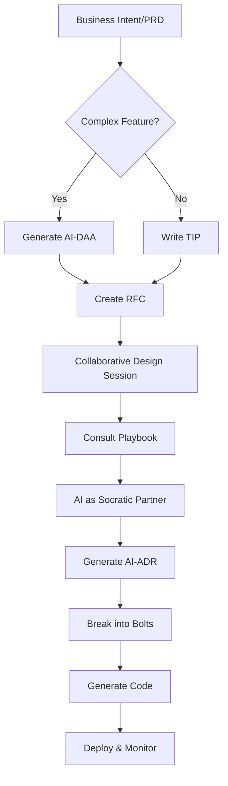

# AirSDLC Overview

## Introduction

The **AI-Responsible Software Development Lifecycle (AirSDLC)** is an actionable framework for AI-driven software development. It provides a structured methodology for transforming ambiguous business requirements into production-ready code through a series of validated, traceable artifacts.

## The Problem AirSDLC Solves

Traditional software development faces several persistent challenges:

- **Requirements Gap**: Business intent often gets lost in translation to technical implementation
- **Premature Technical Decisions**: Teams jump to "how" before fully understanding "what"
- **Documentation Debt**: Design decisions are poorly documented or quickly become stale
- **Context Loss**: When bugs occur, engineers lack the full context from inception to deployment
- **Inconsistent Processes**: Different teams solve the same architectural problems differently

AirSDLC addresses these challenges by formalizing a structured, AI-augmented process with built-in traceability and validation.

## Core Concept: AI-Driven with Human Oversight

AirSDLC inverts the traditional human-AI relationship in software development:

- **Traditional Model**: Human writes code → AI assists with completion
- **AirSDLC Model**: AI generates artifacts → Human validates and directs

In this model:
- **AI's Role**: Generate plans, model domains, propose solutions, identify risks
- **Human's Role**: Validate outputs, make strategic decisions, provide domain expertise, give final approval

This shift moves the human expert from **creator** to **curator**—a higher-leverage position that focuses cognitive energy on evaluation rather than generation.

## The Three Sequential Phases

AirSDLC is built on a sequential knowledge handoff where each phase enriches context for the next:

```
Business Intent → Inception → Design → Construction & Operations
                     ↓           ↓              ↓
                   AI-DAA     AI-ADR      Production Code
```

### Phase 1: Inception (The "WHAT")
**Objective**: Translate business goals into a pure, technology-agnostic domain model

- **Input**: Business Intent / Product Requirements Document (PRD)
- **Process**: AI analyzes requirements and applies Domain-Driven Design (DDD) patterns
- **Output**: AI-DAA (Domain Architecture Analysis) - a vendor-neutral domain model
- **Validation**: Human expert reviews and validates the domain understanding

### Phase 2: Collaborative Design (The "HOW")
**Objective**: Synthesize domain understanding with technical implementation decisions

- **Input**: Validated AI-DAA + Engineer's RFC (Request for Comments)
- **Process**: Human-AI collaborative "Socratic Sparring" session using Architectural Playbook
- **Output**: AI-ADR (Architectural Decision Record) - finalized technical decisions
- **Validation**: Human architect approves architectural choices and trade-offs

### Phase 3: Construction & Operations (The "BUILD & RUN")
**Objective**: Generate code, deploy, and provide context-aware monitoring

- **Input**: Finalized AI-ADR
- **Process**: Break work into "Bolts" (focused implementation units), AI generates boilerplate
- **Output**: Production-ready code, tests, and deployment artifacts
- **Operations**: Context-aware incident response using full traceability chain

## Key Principles

### 1. Technology Agnosticism in Domain Modeling
The AI-DAA is intentionally 100% technology-neutral. It describes the business domain using DDD patterns without specifying databases, frameworks, or languages. This ensures domain understanding is not polluted by technical constraints.

### 2. Sequential Knowledge Handoff
Each phase's validated output becomes the non-negotiable input for the next. This creates an unbroken chain of traceability:

```
Business Goal → PRD Feature → DAA Aggregate → ADR Decision → Code Implementation
```

### 3. Validation as First-Class Activity
Validation is never skipped. Every AI-generated artifact passes through human review before proceeding. This includes:
- **PRD-to-DAA Coverage**: Does the domain model address all requirements?
- **DAA-to-ADR Alignment**: Do technical decisions respect domain invariants?
- **ADR-to-Code Compliance**: Does implementation match the design?

### 4. Pragmatism & Adaptability
AirSDLC provides two workflow paths:
- **Full Workflow**: PRD → AI-DAA → RFC → AI-ADR (for complex/risky features)
- **Lightweight Workflow**: PRD → TIP → RFC → AI-ADR (for simple/well-understood features)

Teams choose based on feature complexity, risk, and domain familiarity.

### 5. Living Knowledge Repository
All artifacts are stored in a "Knowledge Repository" that serves as the single source of truth. This repository enables:
- End-to-end traceability
- Context-aware operations
- AI-powered analysis and reporting
- Post-mortem correlation

## Core Artifacts

AirSDLC defines several key artifact types:

| Artifact | Purpose | Phase | Technology-Specific? |
|----------|---------|-------|---------------------|
| **PRD** | Business requirements | Inception | No |
| **AI-DAA** | Domain model (DDD-based) | Inception | No |
| **TIP** | Technical proposal (lightweight) | Inception | Yes |
| **RFC** | Design discussion forum | Design | Yes |
| **AI-ADR** | Finalized architecture decisions | Design | Yes |
| **Bolt** | Discrete implementation unit | Construction | Yes |
| **Playbook** | Library of approved patterns | Design (reference) | Yes |

See [Artifacts](artifacts.md) for detailed specifications.

## The Workflow at a Glance



See [Workflow](workflow.md) for step-by-step details.

## Benefits

### For Engineering Teams
- **Faster Design Cycles**: AI generates first drafts, humans focus on validation
- **Better Documentation**: Design decisions are captured by default, not as an afterthought
- **Consistent Patterns**: Architectural Playbook ensures team-wide consistency
- **Reduced Context Switching**: Full traceability from business goal to code

### For Architects
- **Strategic Focus**: Spend time on high-level decisions, not boilerplate
- **Knowledge Capture**: Architectural wisdom is codified in reusable patterns
- **AI-Augmented Review**: AI challenges designs using organizational knowledge

### For Operations
- **Context-Rich Debugging**: Correlate production errors to DAA/ADR/PRD
- **Faster MTTR**: AI proposes fixes using full design context
- **Post-Mortem Integration**: Learnings feed back into Knowledge Repository

### For Product Teams
- **Requirements Validation**: AI-generated DAA surfaces misunderstandings early
- **Traceability**: Track which features map to which technical components
- **Predictable Estimates**: Complexity metrics based on domain model

## Framework vs. Implementation

**Important Distinction**:
- **AirSDLC (this repository)**: The framework specification, manifesto, and guidelines
- **Implementation Tools**: Concrete software that implements the framework

This separation ensures:
- Multiple implementations can exist
- The framework evolves independently from tools
- Teams can adapt implementations to their needs while maintaining conformance

## Next Steps

- **Understand the Foundation**: Read [Philosophy](philosophy.md) for core AI-DLC principles
- **Learn the Process**: Study [Workflow](workflow.md) for practical guidance
- **Explore Artifacts**: Review [Artifacts](artifacts.md) for detailed specifications
- **See Examples**: Browse [Examples](examples/README.md) for sample artifacts

## Extensibility

AirSDLC is designed to be extended. Teams can:
- Add custom artifact types
- Define additional validation steps
- Integrate domain-specific patterns into the Playbook
- Customize templates and workflows

See [Extensibility](extensibility.md) for guidelines on adapting the framework.

---

**Next**: [Philosophy](philosophy.md) - Core principles and AI-DLC foundation
