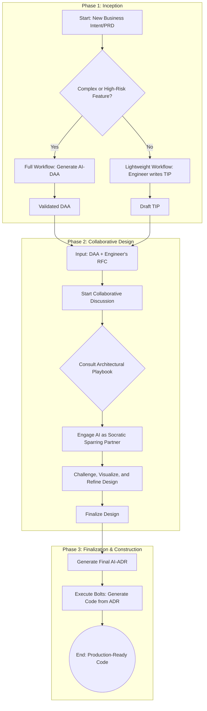

# AirSDLC Workflow

## Overview

This document provides a practical, step-by-step guide to applying the AirSDLC framework. It walks through the complete workflow from receiving a new business requirement to deploying production-ready code.

## Workflow Diagram



## Detailed Step-by-Step Process

### Phase 1: Inception

#### Step 1: Receive and Review PRD

**Participants**: Product Manager, Lead Engineer, Architect

**Input**: New Product Requirements Document (PRD)

**Actions**:
1. **Read the PRD thoroughly**
   - Understand the business objective
   - Review user stories and acceptance criteria
   - Note NFRs (performance, availability, security)
   - Identify constraints (timeline, budget, technical)

2. **Clarify ambiguities**
   - Schedule a quick sync with PM if needed
   - Document assumptions
   - Flag any missing information

**Output**: Clear understanding of requirements

**Time**: 30 minutes - 1 hour

---

#### Step 2: Choose Workflow Path

**Decision Maker**: Lead Engineer or Architect

**Process**: Use the Decision Matrix from [Lifecycle](lifecycle.md#step-1-choose-the-workflow-path)

```
Ask yourself:
- Is the domain familiar to the team?
- How complex are the business rules?
- What's the risk level (financial, reputation, compliance)?
- How tight is the deadline?
- What's the team's experience level?
```

**Decision**:
- **Path A (Full)**: Complex/unfamiliar/high-risk → Generate AI-DAA
- **Path B (Lightweight)**: Simple/familiar/low-risk → Write TIP

**Output**: Decision documented (in commit message, Jira ticket, or project log)

**Time**: 5-15 minutes

---

#### Step 3A: Full Workflow - Generate and Validate AI-DAA

**Participants**: Engineer + AI, then Domain Expert for validation

**Process**:

**3A.1 Generate AI-DAA**
1. Open your AI tool (e.g., ChatGPT, Claude, or any AI assistant)
2. Provide the PRD as context
3. Prompt:
   ```
   You are a Domain-Driven Design expert. Analyze this PRD and generate
   a complete AI-DAA (Domain Architecture Analysis). The DAA must be:
   - 100% technology-agnostic (no databases, frameworks, or languages)
   - Use DDD patterns (Bounded Contexts, Aggregates, Value Objects, Domain Events)
   - Written in clear pseudocode
   - Explicitly state all business invariants
   
   PRD:
   [Paste full PRD here]
   ```
4. Review AI output for:
   - Completeness (all user stories addressed)
   - Clarity (understandable by domain experts)
   - Correctness (accurate domain model)

**3A.2 Validate AI-DAA**
1. Share DAA with domain expert (PM, business analyst, or senior engineer)
2. Walk through the proposed Aggregates and operations
3. Verify invariants match business rules
4. Request AI to generate a "Coverage Report":
   ```
   Compare this AI-DAA against the original PRD. Create a coverage report
   showing:
   - Which user stories are addressed by which operations
   - Any PRD requirements not yet covered
   - Any DAA elements not traceable to PRD
   ```
5. Iterate if gaps are found

**3A.3 Lock the DAA**
Once validated:
- Commit the DAA to the Knowledge Repository (e.g., `docs/daas/booking-cancel-daa.md`)
- Tag as "validated" (e.g., git tag `daa-booking-cancel-v1.0`)
- Link to PRD in metadata

**Output**: Validated AI-DAA document

**Time**: 2-4 hours (including validation session)

---

#### Step 3B: Lightweight Workflow - Write TIP

**Participant**: Engineer

**Process**:

**3B.1 Draft TIP**
1. Create a new TIP document (e.g., `docs/tips/booking-notes-tip.md`)
2. Following the [TIP structure](artifacts.md#3-tip-technical-implementation-proposal), write:
   - Database changes (schema modifications, indexes)
   - API changes (new endpoints, request/response formats)
   - Service modifications (which services need updates)
   - Testing plan (unit, integration tests)
3. Flag any open questions or uncertainties

**3B.2 Self-Review**
Before sharing:
- Does it address all PRD requirements?
- Are edge cases considered?
- Is the estimate realistic?

**Output**: Draft TIP document

**Time**: 1-2 hours

---

### Phase 2: Collaborative Design

#### Step 4: Create RFC

**Participant**: Engineer

**Input**: 
- Validated DAA (from Path A) or Draft TIP (from Path B)
- Initial technical thoughts

**Process**:
1. Create RFC document (e.g., `docs/rfcs/rfc-042-booking-cancel.md`)
2. Follow [RFC structure](artifacts.md#4-rfc-request-for-comments):
   - Add metadata (RFC number, author, date, status: "Draft")
   - Context: Link to PRD, paste or reference DAA/TIP
   - Proposed Solution: Your initial technical approach
   - Open Questions: What needs team input?
   - Constraints: Timeline, budget, must-use technologies
3. Add initial diagrams (architecture, sequence) using Mermaid or PlantUML

**Output**: Draft RFC document

**Time**: 1-2 hours

---

#### Step 5: Consult Architectural Playbook

**Participant**: Engineer or Architect

**Process**:
1. Review the RFC and identify key architectural challenges
   - Data consistency (ACID, eventual consistency)
   - Service communication (sync, async, events)
   - Failure handling (retries, circuit breakers)
   - Performance (caching, indexing)
   - Security (authentication, authorization, encryption)

2. Search the Architectural Playbook for relevant patterns
   - Example: If you need reliable event delivery → "Transactional Outbox Pattern"
   - Example: If you need resilient service calls → "Circuit Breaker Pattern"

3. Add Playbook references to RFC:
   ```markdown
   ## Applicable Patterns
   - OUTBOX-001: Transactional Outbox (for event publishing)
   - IDEMPOTENT-002: Idempotent API Design (for retry safety)
   ```

**Output**: RFC updated with Playbook references

**Time**: 30 minutes - 1 hour

---

#### Step 6: Collaborative Design Session - AI as Socratic Partner

**Participants**: Architect/Senior Engineer + AI

**Input**: Draft RFC with Playbook references

**Process**:

**6.1 Setup the Session**
1. Open AI tool with long context window
2. Load context:
   ```
   You are an expert software architect and my Socratic Sparring Partner.
   I will share an RFC for a new feature. Your role is to:
   - Challenge the design
   - Propose alternatives
   - Analyze trade-offs
   - Ask probing questions
   - Help me explore edge cases
   
   Use the attached Architectural Playbook as your knowledge base.
   
   RFC:
   [Paste full RFC]
   
   Playbook Patterns:
   [Paste relevant Playbook entries]
   ```

**6.2 The Dialogue (Iterative)**

**Round 1: Initial Challenge**
```
Prompt: "Review this RFC. What are the weaknesses in my proposed design? 
What could go wrong?"

AI: [Identifies risks, tight coupling, single points of failure, etc.]

You: [Consider feedback, ask follow-up questions]
```

**Round 2: Explore Alternatives**
```
Prompt: "Propose 3 alternative approaches for [specific component]. 
Compare their trade-offs in terms of complexity, performance, and 
reliability."

AI: [Presents alternatives with pros/cons]

You: [Evaluate options, ask for clarification]
```

**Round 3: Deep Dive on Edge Cases**
```
Prompt: "How should we handle [specific scenario, e.g., partial failure, 
concurrent requests, data inconsistency]?"

AI: [Proposes solutions, references Playbook patterns]

You: [Refine approach]
```

**Round 4: Visualize the Design**
```
Prompt: "Generate a sequence diagram showing the full flow from API request 
to event publishing, including failure scenarios."

AI: [Generates Mermaid diagram]

You: [Review, identify gaps, request refinements]
```

**6.3 Iteration**
Repeat the above rounds until:
- All major risks are addressed
- Edge cases have clear handling strategies
- Trade-offs are explicitly documented
- You feel confident the design is robust

**Output**: Refined RFC with:
- Updated technical approach
- Diagrams showing final design
- Documented trade-offs
- Answers to all open questions

**Time**: 2-4 hours (can be broken into multiple sessions)

---

#### Step 7: Team Review (Optional but Recommended)

**Participants**: Architect, Senior Engineers, Domain Experts

**Input**: Refined RFC from Step 6

**Process**:
1. Share RFC with team (via PR, email, or design review meeting)
2. Gather feedback:
   - Are there concerns about the approach?
   - Have we missed any edge cases?
   - Are the trade-offs acceptable?
3. Incorporate feedback into RFC

**Output**: RFC status updated to "Under Review"

**Time**: 1-2 days (async) or 1 hour (sync meeting)

---

#### Step 8: Finalize Design and Generate AI-ADR

**Participant**: Architect/Senior Engineer

**Input**: Reviewed and refined RFC

**Process**:

**8.1 Final Approval**
- Mark RFC status as "Approved"
- Document final decisions

**8.2 Generate AI-ADR**
Prompt AI:
```
Based on this approved RFC, generate a formal AI-ADR (Architectural 
Decision Record). The ADR should follow this structure:
- Metadata (ADR number, title, status, links to PRD/DAA/RFC)
- Context (problem statement from DAA)
- Decision (clear statement of chosen approach)
- Rationale (why this approach, referencing DAA invariants and NFRs)
- Implementation Details (tech stack, schemas, API contracts, diagrams)
- Edge Cases (how we handle failures, concurrency, etc.)
- Monitoring (metrics, alerts)
- Rejected Alternatives (what we considered and why rejected)

RFC:
[Paste approved RFC]
```

**8.3 Review and Lock ADR**
1. Review AI-generated ADR for accuracy
2. Ensure it contains enough detail for implementation
3. Commit to Knowledge Repository (e.g., `docs/adrs/adr-023-booking-cancel.md`)
4. Tag as "accepted" (e.g., git tag `adr-booking-cancel-v1.0`)

**Output**: Finalized, immutable AI-ADR

**Time**: 1-2 hours

---

### Phase 3: Construction

#### Step 9: Break Down into Bolts

**Participant**: Engineer

**Input**: Finalized AI-ADR

**Process**:
1. Read ADR thoroughly, especially "Implementation Details" section
2. Identify discrete, testable components:
   - Example: "API endpoint implementation"
   - Example: "Database migration"
   - Example: "Background worker for outbox relay"
   - Example: "Monitoring dashboard"
3. For each component, create a Bolt:
   - Bolt ID (sequential, e.g., BOLT-042)
   - Goal (one-sentence description)
   - Acceptance criteria (from ADR)
   - Estimated effort (hours/days)
4. Order Bolts by dependency (what must be done first)

**Output**: Bolt backlog (can be managed in Jira, Linear, or markdown file)

**Example Bolt Breakdown**:
```markdown
## Bolts for ADR-023: Booking Cancellation Feature

1. **BOLT-042**: Create database migration for booking status
   - Estimated: 2 hours
   - Dependencies: None
   - AC: Migration adds `status` column with proper constraints and transitions

2. **BOLT-043**: Implement Booking aggregate and cancel operation
   - Estimated: 4 hours
   - Dependencies: BOLT-042
   - AC: cancel() method enforces invariants, returns domain event

3. **BOLT-044**: Implement POST /bookings/{id}/cancel API endpoint
   - Estimated: 6 hours
   - Dependencies: BOLT-043
   - AC: Endpoint validates input, calls aggregate, writes to outbox

4. **BOLT-045**: Implement outbox relay worker for booking events
   - Estimated: 8 hours
   - Dependencies: BOLT-044
   - AC: Worker polls outbox, publishes to Kafka, handles errors

5. **BOLT-046**: Add monitoring and alerts
   - Estimated: 3 hours
   - Dependencies: BOLT-045
   - AC: Dashboards show cancellation metrics, alerts configured
```

**Time**: 1-2 hours

---

#### Step 10: Implement Each Bolt

**Participant**: Engineer

**Input**: Single Bolt from backlog

**Process** (for each Bolt):

**10.1 Start Bolt**
- Update Bolt status to "In Progress"
- Create feature branch (e.g., `feature/bolt-042-booking-status-migration`)

**10.2 Use AI for Boilerplate Generation**
Prompt AI:
```
Based on ADR-023, generate [specific component] for BOLT-042. I need:
- [Database migration, API handler, service method, etc.]
- Follow our team's coding standards
- Include input validation and error handling

ADR Section:
[Paste relevant ADR section]

Bolt Goal:
[Paste Bolt description]
```

AI generates scaffolding code.

**10.3 Implement Core Logic**
- Review AI-generated boilerplate
- Implement complex business logic yourself (this is where human expertise shines)
- Refactor as needed

**10.4 Generate Tests**
Prompt AI:
```
Generate comprehensive unit tests for this code. Cover:
- Happy path
- Edge cases (e.g., invalid input, concurrent modifications)
- Error scenarios

Code:
[Paste your implementation]
```

Review and supplement AI-generated tests.

**10.5 Self-Review**
- Does code match ADR specification?
- Are all acceptance criteria met?
- Are edge cases handled per ADR?
- Are tests comprehensive?

**10.6 Submit for Review**
- Create Pull Request
- Link to ADR and Bolt in PR description
- Request review from peer or architect

**10.7 Address Feedback and Merge**
- Incorporate review feedback
- Merge when approved

**10.8 Update Bolt Status**
- Mark Bolt as "Done"
- Record actual effort

**Output**: Merged code for one Bolt

**Time**: Varies (hours to days per Bolt)

---

#### Step 11: Validate Against ADR

**Participant**: Engineer (with AI assistance)

**Input**: Completed Bolts

**Process**:
After all Bolts for an ADR are complete, perform final validation:

Prompt AI:
```
I've completed all Bolts for ADR-023. Generate a Compliance Report:
- Compare the final implementation against the ADR specification
- Identify any discrepancies
- Verify all edge cases from ADR are handled
- Check if monitoring/alerts are configured as specified

ADR:
[Paste ADR]

Code:
[Link to code repo or paste relevant files]
```

Review AI's compliance report. If discrepancies found:
- Create Fix-It Bolts for missing items
- OR update ADR if implementation revealed better approaches (create ADR amendment)

**Output**: Compliance report, with action items if needed

**Time**: 1-2 hours

---

#### Step 12: Deploy

**Participant**: Engineer, DevOps/SRE

**Input**: Completed, tested code

**Process**:
1. **Staging Deployment**
   - Deploy to staging environment
   - Run smoke tests
   - Validate monitoring/alerts are working

2. **Production Deployment**
   - Deploy via standard CI/CD pipeline
   - Monitor dashboards during rollout
   - Validate success metrics from PRD

3. **Rollback Plan**
   - Document rollback steps
   - Keep previous version available for quick revert

**Output**: Feature live in production

**Time**: Varies (minutes to hours, depending on CI/CD maturity)

---

### Phase 3: Operations (Ongoing)

See [Operations](operations.md) for detailed incident response workflow.

**High-Level Process**:
1. **Monitoring**: Dashboards track metrics from ADR
2. **Alerting**: Alerts fire on threshold breaches
3. **Incident Response**: AI-assisted triage using full traceability chain
4. **Post-Mortem**: Document learnings, feed back into Knowledge Repository

---

## Workflow Cheat Sheet

### For New Features

| Step | Artifact | Time | Key Decision |
|------|----------|------|--------------|
| 1. Review PRD | - | 30min-1hr | Understand requirements |
| 2. Choose Path | - | 15min | Full or Lightweight? |
| 3A. Generate DAA | AI-DAA | 2-4hrs | Domain modeling |
| 3B. Write TIP | TIP | 1-2hrs | Technical proposal |
| 4. Create RFC | RFC | 1-2hrs | Formalize design |
| 5. Consult Playbook | - | 30min-1hr | Identify patterns |
| 6. AI Sparring | Refined RFC | 2-4hrs | Challenge design |
| 7. Team Review | - | 1-2 days | Gather feedback |
| 8. Generate ADR | AI-ADR | 1-2hrs | Lock design |
| 9. Plan Bolts | Bolt Backlog | 1-2hrs | Break down work |
| 10. Implement | Code | Days-weeks | Build feature |
| 11. Validate | Compliance Report | 1-2hrs | Verify against ADR |
| 12. Deploy | Deployment Unit | Minutes-hours | Go live |

### Decision Points

**Full vs. Lightweight Workflow**
- Complex domain → Full (AI-DAA)
- Simple feature → Lightweight (TIP)
- When in doubt → Full (invest in understanding)

**When to Generate Diagrams**
- Always during Collaborative Design (Step 6)
- For complex flows, edge cases, or state machines
- Use diagrams-as-code (Mermaid, PlantUML) for version control

**When to Update Architectural Playbook**
- When you solve a recurring problem in a novel way
- After post-mortems reveal patterns
- When team develops new best practices

---

## Tips for Success

### 1. Start Small
Don't try to adopt the full workflow on day one. Start with:
- Week 1: Use AI to generate DAAs for 1-2 features
- Week 2: Try the Collaborative Design session (Step 6)
- Week 3: Implement ADR-driven construction with Bolts

### 2. Iterate on Templates
Customize the artifact templates to fit your team:
- Add your tech stack to ADR template
- Include your company's code style in Bolt templates
- Tailor Playbook entries to your common challenges

### 3. Build Your Playbook Gradually
Start with 3-5 core patterns:
- Transactional Outbox Pattern
- Idempotent API Design
- Circuit Breaker Pattern
- Retry with Exponential Backoff
- Database Migration Strategy

Add new patterns as your team encounters new challenges.

### 4. Treat AI as a Junior Engineer
- Always review AI output critically
- Use AI for boilerplate, you handle complex logic
- Teach AI your context (PRD, DAA, Playbook)

### 5. Maintain the Knowledge Repository
- Commit every artifact (DAA, ADR, RFC, Bolt, Post-mortem)
- Use meaningful commit messages
- Tag major versions (e.g., `adr-booking-cancel-v1.0`)
- Keep it searchable (markdown + git grep is powerful)

### 6. Celebrate Traceability
When debugging, show your team:
```
This error in booking_service.go:152 
→ was implemented in BOLT-043 
→ based on ADR-023 
→ which implements the DAA from booking-cancel-daa.md 
→ which fulfills User Story 3 in PRD-015
```

This demonstrates the power of AirSDLC.

---

**Next**: [Operations](operations.md) - Post-deployment and incident handling
